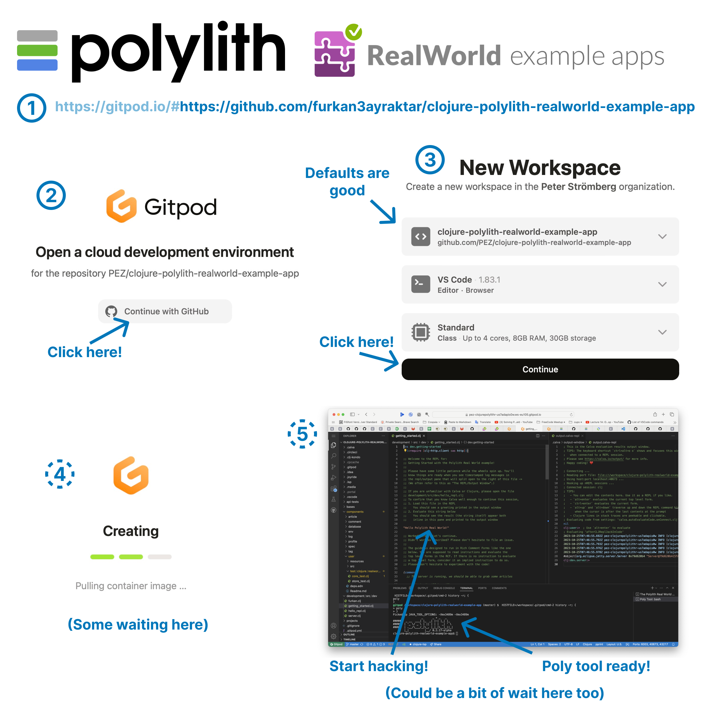

# Hack on Real World Polylith in your Browser

Using [Gitpod](https://www.gitpod.io) you can explore a [Polylith](https://polylith.gitbook.io/polylith/) implementation of [Real World](https://www.realworld.how/) from the Clojure REPL, without downloading or installing anything at all.

Don't click on this link just yet: 
https://gitpod.io/#https://github.com/PEZ/clojure-polylith-realworld-example-app

The link will take you to a full blown [VS Code](https://code.visualstudio.com/) running in your browser. The VS Code instance will have [Clojure](https://clojure.org) development support (through [Calva](https://calva.io)). The first time you use it, it may be quite a long wait. But then (after some little more waiting) you will be in the editor, connected to the REPL of the Polylith Real World server!

## Prerequisites

* A Github account.
* Curiosity

That's it.

## From here to the Polylith REPL

When you click the link you will first need to sign in to Gitpod using your Github account, then create the workspace, then wait, then wait a bit again. Then you will have the REPL under your fingertips. The process looks like so:

The Clojure file that opens will have further instructions and suggestions for what you can try at the REPL. There's also a file `src/hello_repl.clj` available for anyone unfamiliar with Calva and/or Clojure to start with.

Now you can click that link above. 😄

Happy coding! ❤️

TODO: Change the link to https://github.com/furkan3ayraktar/clojure-polylith-realworld-example-app before merging. And update the screenshots in [.media/gitpod](.media/gitpod).
