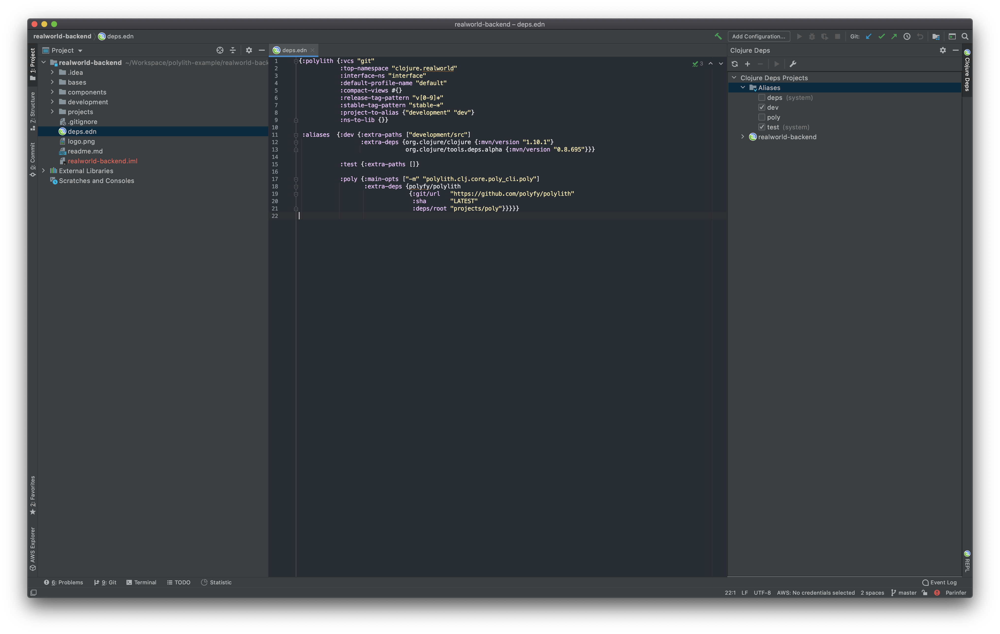

## How to create this workspace from scratch
Workspace structure follows the Polylith Architecture ideas. Polylith plugin makes it easy to create a workspace, add components, and build the project. Here, you can find all the steps required to create this workspace from scratch.

###### Install Leiningen
Leiningen is one of the main dependency management tools in the Clojure world. If you don't have it already on your computer, you can start by installing it.
- Go to leiningen.org and download lein script.
- Place it on your $PATH where your shell can find it
  - You can put it under `` ~/bin `` folder, or similar 
- Set it to be executable 
  - `` chmod a+x ~/bin/lein ``
- Run `` lein `` on your shell and it will download and install itself
- You can run `` lein version `` to validate installation

###### Install Polylith plugin
Polylith plugin is a leiningen plugin. You need to install it globally in order to use it to create a workspace.
- Go to your leiningen folder
  - `` cd ~/.lein ``
- If you don't have already, create `` profiles.clj ``
  - `` vi profiles.clj ``
- Add Polylith plugin to use profile.
  - `` {:user {:plugins [[polylith/lein-polylith "0.1.1"]]}} ``
    - If you want to receive latest versions, you can write "LATEST" instead of "0.1.1".
- Save the file with `` :wq ``

###### Create a workspace
- `` lein polylith create workspace realworld-app clojure.realworld ``
  - This will create your workspace under a folder named `` realworld-app ``
  - Your code will end up in a package named `` clojure.realworld ``
  - Inside your workspace, you'll find the following structure:
    - `` bases ``
    - `` components ``
    - `` environments ``
      - `` development ``
    - `` interfaces ``
    - `` systems ``
  - If you look inside these folders, you'll see that bases, components, and systems are empty. Environments has the default environment named development. This will be the project you will develop locally. It has links to all other bases, components, and interfaces inside your workspace.

###### Open development environment in IDE
You can open development environment with your favorite IDE. It will be something like this:

###### Create a system with a base
Systems are the projects where all the components are glued together on top of a base. You can create a system together with a base with the Polylith plugin.
- `` lein polylith create system realworld-backend rest-api ``
  - This command will create a system named `` realworld-backend `` and a base named `` rest-api ``.
  - If you check src folder under `` systems/realworld-backend `` you will see a link to `` bases/rest-api `` 
  - Newly created base will be visible in the development project, as well as other related files from system

- The base named `` rest-api `` will contain our Ring configuration and handlers. You can check out the code in the repository.

###### Create components
- `` lein polylith create component article ``
- `` lein polylith create component comment ``
- `` lein polylith create component database ``
- `` lein polylith create component log ``
- `` lein polylith create component profile ``
- `` lein polylith create component spec ``
- `` lein polylith create component tag ``
- `` lein polylith create component user ``
  - These command above will create components under `` components `` folder and link them to the development project.

- However, our components are not yet linked to any system.

###### Add components to system
- `` lein polylith add article realworld-backend ``
- `` lein polylith add comment realworld-backend ``
- `` lein polylith add database realworld-backend ``
- `` lein polylith add log realworld-backend ``
- `` lein polylith add profile realworld-backend ``
- `` lein polylith add spec realworld-backend ``
- `` lein polylith add tag realworld-backend ``
- `` lein polylith add user realworld-backend ``
  - These commands will add components to system named `` realworld-backend ``

###### Test and build
- To run tests and build artifacts, run the following command on project root:
  - `` lein polylith build ``
  - When you build the project, it will create an artifact from each system in your workspace.

- This command will run all the tests in all components and bases, validate the interface dependencies between them and build an artifact for each system.
- It will also update :last-success in the file `` .polylith/time.edn ``. If you try building it again, you'll see that none of the tests will run and no artifacts will be built. This is because Polylith plugin checks the `` :last-success ``, detects changes since that time and finds parts in the workspace that needs a rebuild.
- You can force plugin to build since a specific time by passing a unix time as another argument, or 0 to build everything.
- If you run same command on a CI system (having a CI bash variable), it will use `` .polylith/git.edn `` file to detect changes. Instead of files' modified date, it will use git to detect changes since the last successful git commit.

###### Make a change and build affected parts
- Change a namespace in one of the components
- Run `` lein polylith build ``
- It will only test the changed component and build the system since it is affected.

###### Running command separately
- If you want to run compile, test, build and success commands separately, you can use specific commands. Each command takes arguments to skip previous steps.
  - `` lein polylith build -compile -test -success `` will only build and skip compile, test, and success steps.
  - Similarly, `` lein polylith test `` will both compile and test changes. If you run `` lein polylith test -compile ``, it will skip compilation and only test.

#### Sample IDE run configurations for polylith commands

###### Build

###### Build All

###### Test

###### Test All

