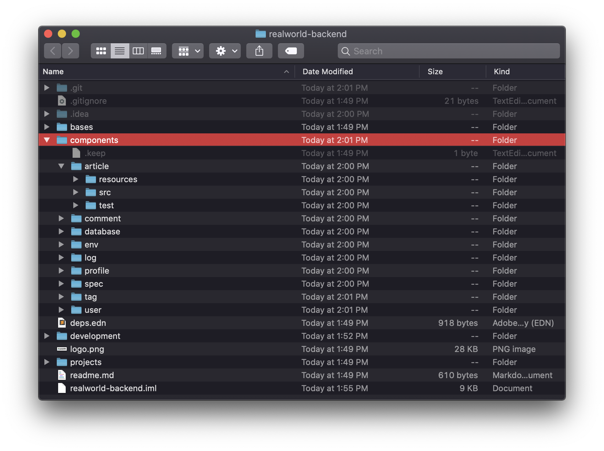
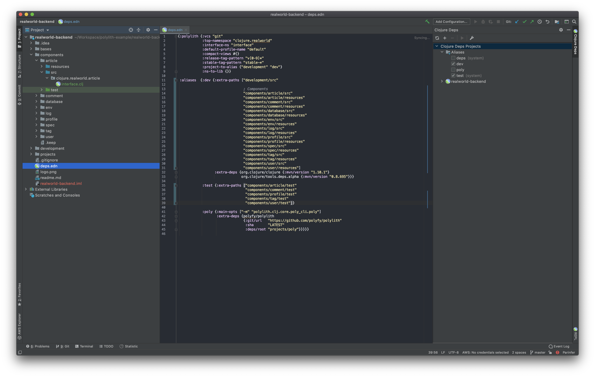
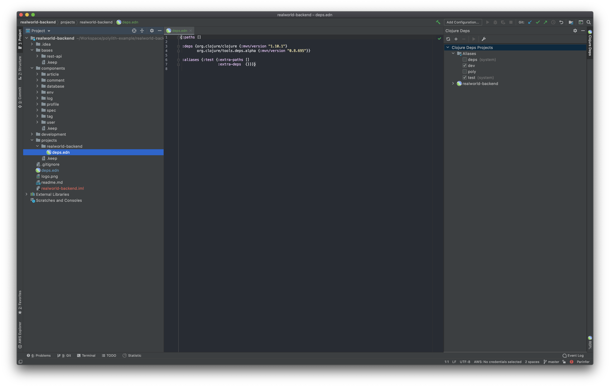
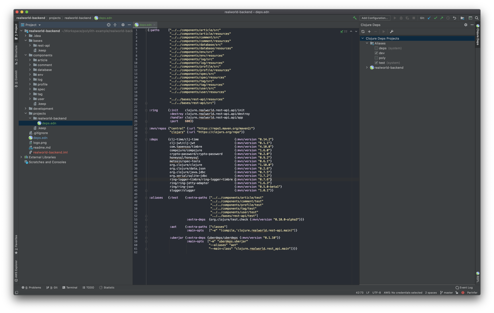

## How to create this workspace from scratch
Workspace structure follows the Polylith Architecture ideas. The Polylith tool makes it easy to create a workspace, add components, and test and validate the project. Here, you can find all the steps required to create this workspace from scratch.

###### Install Clojure
If you do not have Clojure installed on your machine already, you can install it through [Homebrew](https://brew.sh/) on MacOS by running:

```sh
brew install clojure/tools/clojure
```

Check out [Clojure page](https://clojure.org/guides/getting_started) for more options on installing.

###### Install Polylith Tool
Polylith provides a command line tool that you can install on your machine to improve your development experience. You can install it through Homebrew on MacOS by running:

```sh
brew install polyfy/polylith/poly
```

Check out [Polylith repo](https://github.com/polyfy/polylith#installation) for more installation options.

###### Create a workspace
- `` poly create workspace name:realworld-app top-ns:clojure.realworld ``
  - This will create your workspace under a folder named `` realworld-app ``
  - Your code will end up in a package named `` clojure.realworld ``
  - Inside your workspace, you'll find the structure as in the image below.
  - If you look inside these folders, you'll see that bases, components, and projects are empty.


Once the workspace is created, navigate to workspace directory: `` cd realworld-backend ``

###### Open development environment in IDE
You can open development environment with your favorite IDE. It will look like the following at this stage if you open it with [Intellij IDEA](https://www.jetbrains.com/idea/) with [Cursive](https://cursive-ide.com) plugin:


###### Create components
- `` poly create component name:article ``
- `` poly create component name:comment ``
- `` poly create component name:database ``
- `` poly create component name:env ``
- `` poly create component name:log ``
- `` poly create component name:profile ``
- `` poly create component name:spec ``
- `` poly create component name:tag ``
- `` poly create component name:user ``

These command above will create components under `` components `` directory.



However, our components are not yet added to development project's `` deps.edn ``. In order to start working with them, you need to add them to `` deps.edn `` in the root directory as following:



As you can notice, we added the components' source and resource directories under the `` :dev `` alias and the test directories under the `` :test `` alias. Once you do this and load dev and test aliases, you can start working with your components.

###### Create base
- `` poly create base name:rest-api ``

This command will create a base named `` rest-api `` under bases directory. Same as components, you should add the source, resource and test directories of `` rest-api `` base to the `` deps.edn `` file in the workspace root. It will look as following:


###### Add code to components and the base
You can take the code from the [repository]() to populate the components and the base. You should also add the necessary dependencies to the `` deps.edn `` file in the workspace root.

Once your code is ready, you can move on to the next step to create a project.

###### Create a project
- `` poly create project name:realworld-backend ``

This command will create a new directory under `` projects/realworld-backend ``. If you look into that directory, you will see that there is only a single file, named `` deps.edn `` and it will look like this:



This is where you will place the configuration for your project. In Polylith, a project is a configuration which includes a single base, a set of components and library dependencies. Since our project is a very simple one with one single artifact, we'll include our only base and all of our components in this configuration. After adding those, it will look like this:



As you can notice, we also have some extra configuration necessarry for our specific project, such as, ring configuration and two special aliases (`` :aot `` and `` :uberjar ``) for creating aot compiled uberjar artifact.

At this stage, you should have a copy of this repository. 

###### Workspace info
```sh
poly info
```

This command will print out the information about the current workspace. You can find documentation about it in the [Polylith repository](https://github.com/polyfy/polylith). It should print an output like this:


Here the asterisk symbol points the changed components and bases since the last stable point.

###### Validating intergrity
In order to validate the integratiy of Polylith workspace, run the following command:

```sh
poly check
```

This command should output `` OK `` as message if everything is okay. Otherwise, it will print out errors and warnings found in the workspace.

###### Running tests
```sh
poly test
```

This command will run all the tests since the last stable point. Since this is a newly created workspace, last stable point will be since the beginning.

###### Adding a stable point
Once you are ready with your changes and the check and test commands run without any issues, you can commit your changes to your git repository. After commiting, you can add a git tag with `` stable- `` prefix. This will tell Polylith to take that commit as the last stable point next time you run any Polylith commands.

```sh
git tag -f -a "stable-master" -m "Stable point"
```

After adding tag, you can run info command again and get an output similar to this:


#### Sample REPL run configuration for Intellij IDEA with Cursive
Polylith works out-of-the-box with Intellij IDEA + Cursive setup. Here is how my REPL run configuration looks like:


The only thing that is different from default Cursive REPL configuration is, I selected Run with Deps option and added two aliases (``dev,test``) that comes from Polylith workspace `` deps.edn ``.
