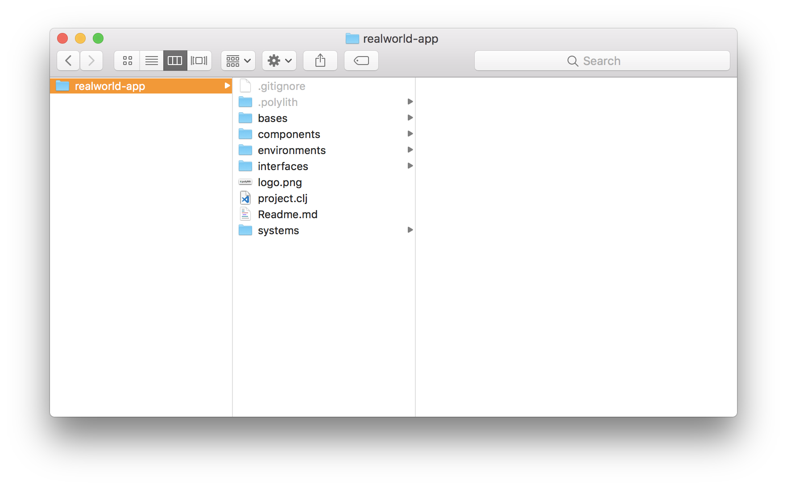
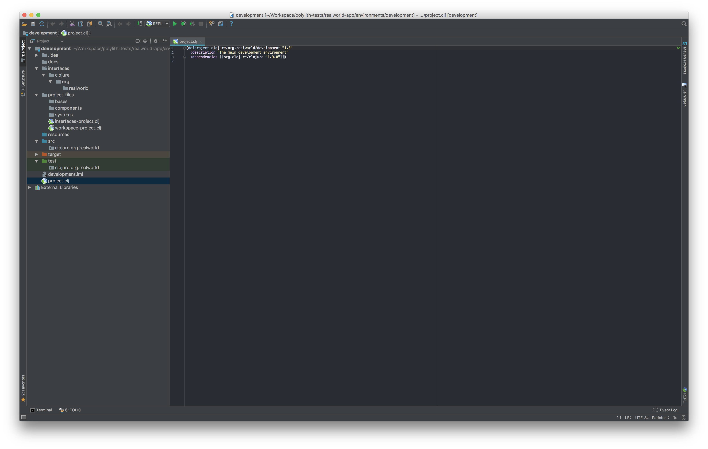
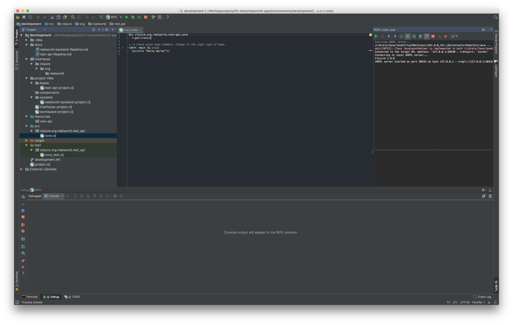
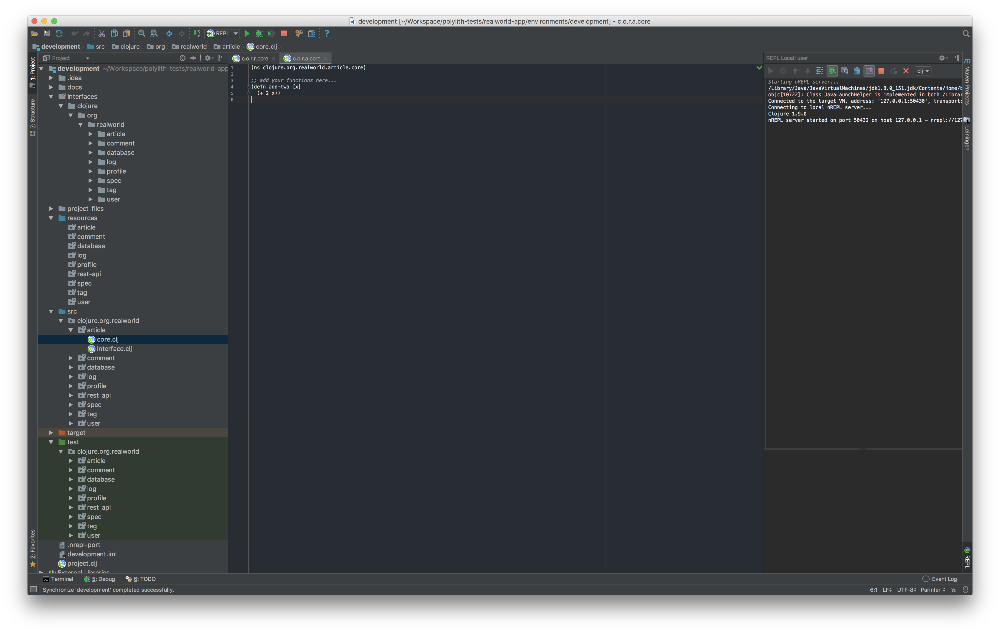
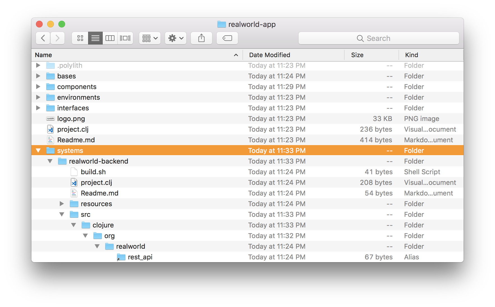
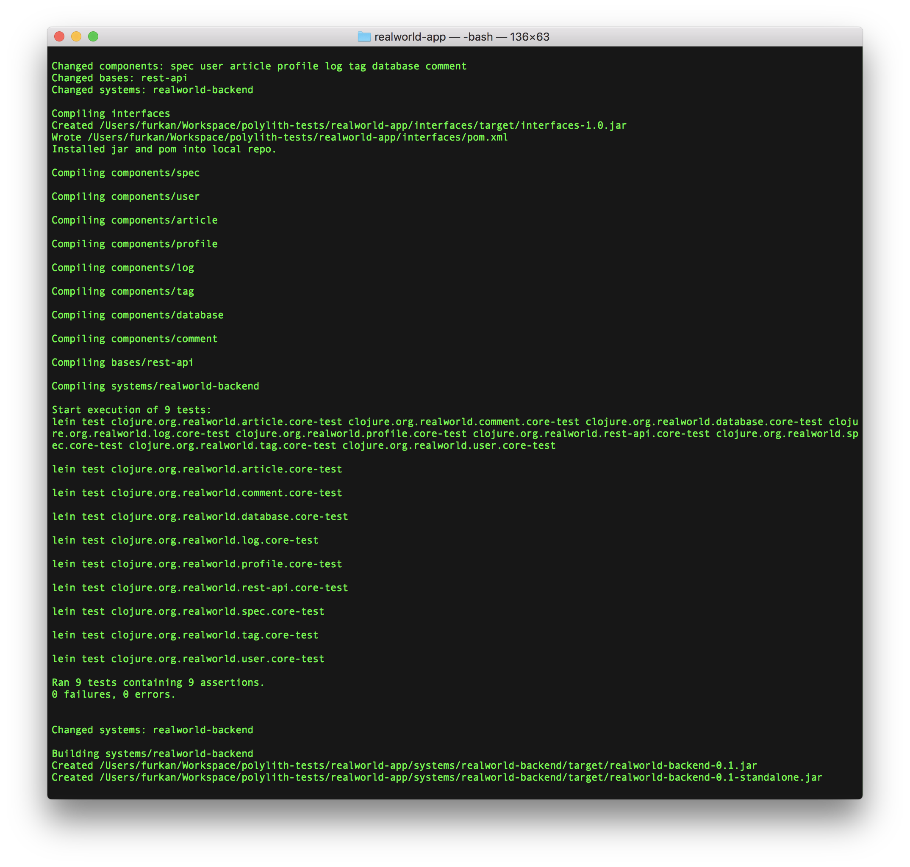

# 

> ### Clojure, Polylith and Ring codebase containing real world examples (CRUD, auth, advanced patterns, etc) that adheres to the [RealWorld](https://github.com/gothinkster/realworld-example-apps) spec and API.

### [RealWorld](https://github.com/gothinkster/realworld)

This codebase was created to demonstrate a fully fledged fullstack application built with **Clojure, Polylith and Ring** including CRUD operations, authentication, routing, pagination, and more.

We've gone to great lengths to adhere to the **Clojure** community styleguides & best practices.

For more information on how to this works with other frontends/backends, head over to the [RealWorld](https://github.com/gothinkster/realworld) repo.

### Getting started

Just a few steps to have you up and running locally:

+ Download and install [leiningen](https://github.com/technomancy/leiningen)
+ Clone this repo
+ Open a terminal, navigate to environments/development and run `` lein ring server-headless ``

And you're up!

### General Structure
The application uses [Ring](https://github.com/weavejester/lein-ring) and [Polylith](https://github.com/tengstrand/lein-polylith) plugins heavily. Project is structured according to [Polylith Architecture](https://polylith.gitbook.io/polylith/) principles. If you are not familiar with Polylith Architecture, please refer to its .readmeumentation for further and deeper understanding. You can find detailed instructions below to create this structure from scratch. Main folders in the project are:
+ `` bases ``
  + `` rest-api `` 
+ `` components ``
  + `` article `` 
  + `` comment `` 
  + `` database `` 
  + `` log `` 
  + `` profile `` 
  + `` spec `` 
  + `` tag `` 
  + `` user `` 
+ `` environments ``
  + `` development `` 
+ `` interfaces ``
+ `` systems ``
  +  `` realworld-backend `` 

Bases are the main building blocks of the Polylith Architecrture. There is only one base and one system in this project to make it simple. Each base and component in the system has its isolated source code, tests, and dependencies. Components in the system communicates to each other through 'interfaces'. These sources are linked and bundled under the system named 'realworld-backend'. Development environment makes it easy to develop with links to each base and component. You can run a REPL within the environment, start the Ring server for debugging or refactor between components easily with using your favorite IDE (mine is Intellij IDEA with [Cursive](https://cursive-ide.com) plugin).

Polylith plugin also helps to test and build incrementally. If you run `` lein polylith test-and-build `` command on the root folder of project, it will detect changes made since the last build and only run tests for the recent changes. Check out Polylith Plugin repository for further information or simply write `` lein polylith help `` to see available commands.

### Environment Variables
+ `` :allowed-origins ``
  + Comma separated string of origins. Used to whitelist origins for CORS.
+ `` :environment ``
  + Defines current environment. Currently used for logging. If set to LOCAL, logs printed to console.
+ `` :database ``
  + Defaults to database.db. If provided, it will be the name of the file that contains SQLite database.
+ `` :secret ``
  + Secret for JWT token.

### Database
It uses a SQLite database to make it easy to run. It can be changed easily by other sql databases by editing database connection and changing to proper jdbc dependency. There is an existing database under development environment, ready to use. If you want to start from scratch, you can delete database.db and start the server again. It will generate a database with correct schema on start. The system also checks if the schema is valid or not, and prints out proper logs for each case.

### Running tests
Run following command in the root folder:
`` lein polylith test ``

Alternatively, to run all tests in your development environment, run following command under environments/development:
`` lein test ``

### Continuous integration
This repository has a [CircleCI](https://circleci.com) configuration to demonstrate how to use Polylith plugin to incrementally run tests and build artifacts. Some commented out parts in the config show an example way to deploy the application to the AWS.

TODO: explain in detail

### How to create this workspace from scratch
Workspace structure follows the Polylith Architecture ideas. Polylith plugin makes it easy to create a workspace, add components, and build the project. Here, you can find all the steps required to create this workspace from scratch.

###### Install Leiningen
Leiningen is one of the main dependency management tools in the Clojure world. If you don't have it already on your computer, you can start by installing it.
- Go to leiningen.org and download lein script.
- Place it on your $PATH where your shell can find it
  - You can put it under `` ~/bin `` folder, or similar 
- Set it to be executable 
  - `` chmod a+x ~/bin/lein ``
- Run `` lein `` on your shell and it will download and install itself
- You can run `` lein version `` to validate installation

###### Install Polylith plugin
Polylith plugin is a leiningen plugin. You need to install it globally in order to use it to create a workspace.
- Go to your leiningen folder
  - `` cd ~/.lein ``
- If you don't have already, create `` profiles.clj ``
  - `` vi profiles.clj ``
- Add Polylith plugin to use profile.
  - `` {:user {:plugins [[polylith/lein-polylith "0.0.39-alpha"]]}} `` 
- Save the file with `` :wq ``

###### Create a workspace
- `` lein polylith create workspace realworld-app clojure.org.realworld `` 
  - This will create your workspace under a folder named `` realworld-app ``
  - Your code will end up in a package named `` clojure.org.realworld ``
  - Inside your workspace, you'll find the following structure:
    - `` bases ``
    - `` components ``
    - `` environments ``
      - `` development ``
    - `` interfaces ``
    - `` systems ``
  - If you look inside these folders, you'll see that bases, components, and systems are empty. Environments has the default environment named development. This will be the project you will develop locally. It has links to all other bases, components, and interfaces inside your workspace.

###### Open development environment in IDE
You can open development environment with your favorite IDE. It will be something like this:

###### Create a system with a base
Systems are the projects where all the components are glued together on top of a base. You can create a system together with a base with the Polylith plugin. When you build the project, it will create an artifact from each system in your workspace.
- `` lein polylith create system realworld-backend rest-api ``
  - This command will create a system named `` realworld-backend `` and a base named `` rest-api ``.
  - If you check src folder under `` systems/realworld-backend `` you will see links to `` bases/rest-api `` 
  - Newly created base will be visible in the development project, as well as other related files from system

- The base named `` rest-api `` will contain our Ring configuration and handlers. You can check out the code in the repository.

###### Create components
- `` lein polylith create component article ``
- `` lein polylith create component comment ``
- `` lein polylith create component database ``
- `` lein polylith create component log ``
- `` lein polylith create component profile ``
- `` lein polylith create component spec ``
- `` lein polylith create component tag ``
- `` lein polylith create component user ``
  - These command above will create components under `` components `` folder and link them to the development project.

- However, our components are not yet linked to any system.

###### Add components to system
- `` lein polylith add article realworld-backend ``
- `` lein polylith add comment realworld-backend ``
- `` lein polylith add database realworld-backend ``
- `` lein polylith add log realworld-backend ``
- `` lein polylith add profile realworld-backend ``
- `` lein polylith add spec realworld-backend ``
- `` lein polylith add tag realworld-backend ``
- `` lein polylith add user realworld-backend ``
  - These commands will add components to system named `` realworld-backend ``

###### Test and build
- To run tests and build artifacts, run the following command on project root:
  - `` lein polylith test-and-build ``

- This command will run all the tests in all components and bases, validate the interface dependencies between them and build an artifact for each system.
- It will also update :last-successful-build in the file `` .polylith/time.local.edn ``. If you try building it again, you'll see that none of the tests will run and no artifacts will be built. This is because Polylith plugin checks the `` :last-successful-build ``, detects changes since that time and finds parts in the workspace that needs a rebuild.
- You can force plugin to build since a specific time by passing a unix time as another argument, or 0 to build everything.

###### Make a change and build affected parts
- Change a namespace in one of the components
- Run `` lein polylith test-and-build ``
- It will only test the changed component and build the system since it is affected.

