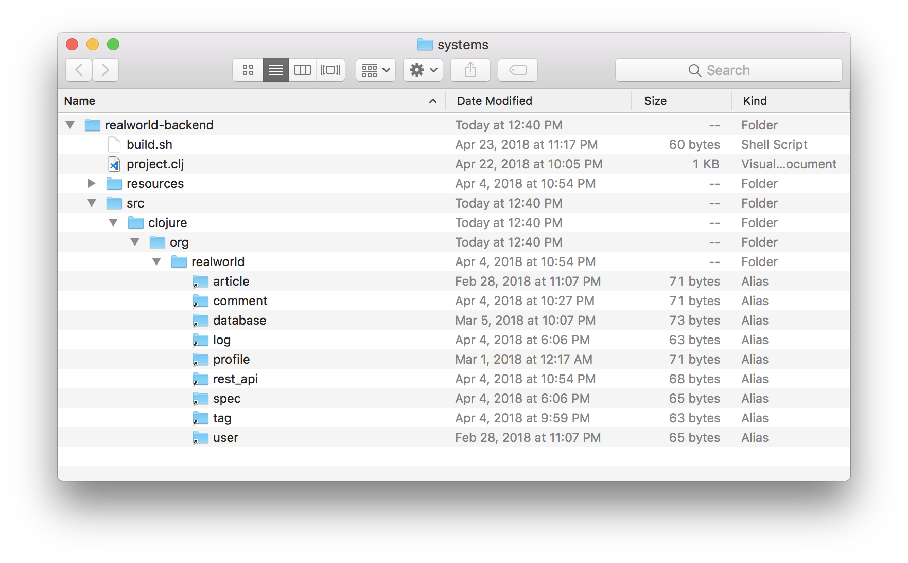
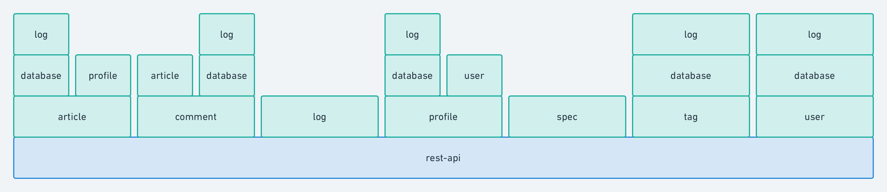
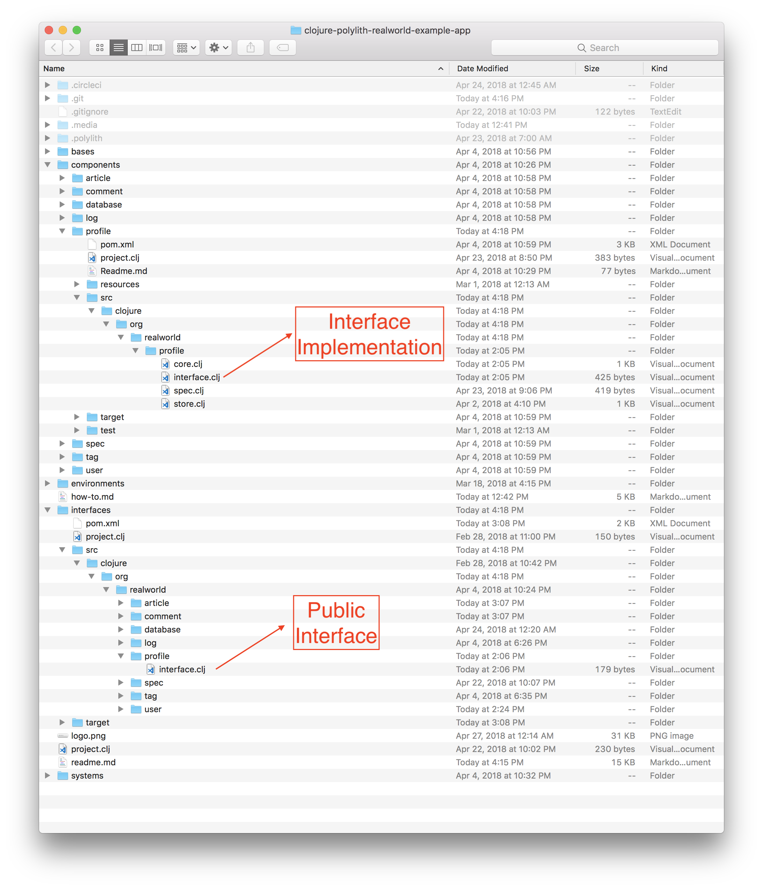
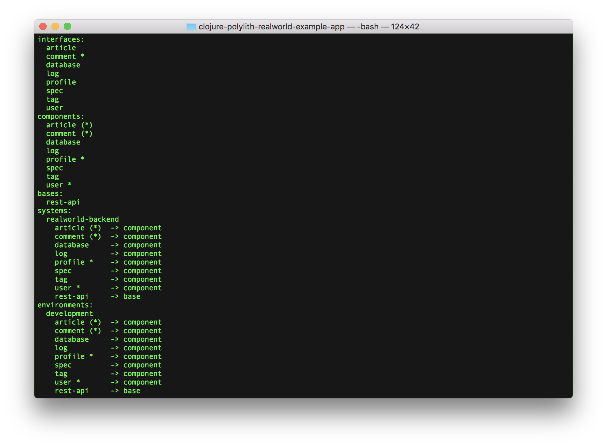

# 

> ### Clojure, Polylith and Ring codebase containing real world examples (CRUD, auth, advanced patterns, etc) that adheres to the [RealWorld](https://github.com/gothinkster/realworld-example-apps) spec and API.


### [RealWorld](https://github.com/gothinkster/realworld)


This codebase was created to demonstrate a fully fledged fullstack application built with **Clojure, Polylith and Ring** including CRUD operations, authentication, routing, pagination, and more.

We've gone to great lengths to adhere to the **Clojure** community styleguides & best practices.

For more information on how this works with other frontends/backends, head over to the [RealWorld](https://github.com/gothinkster/realworld) repo.

> ### There is a newer version of this project that uses [tools.deps](https://github.com/clojure/tools.deps.alpha). You can find it on the [master branch](https://github.com/furkan3ayraktar/clojure-polylith-realworld-example-app/tree/master).

#### Build Status
[](https://circleci.com/gh/furkan3ayraktar/clojure-polylith-realworld-example-app/tree/leiningen)

## Table of Contents

- [Getting Started](#getting-started)
- [General Structure](#general-structure)
  - [System](#system)
  - [Base](#base)
  - [Components](#components)
- [Environment Variables](#environment-variables)
- [Database](#database)
- [Printing Changes](#printing-changes)
- [Running Tests](#running-tests)
- [Continuous Integration](#continuous-integration)
- [How to create this workspace from scratch](#how-to-create-this-workspace-from-scratch)

### Getting started

Just a few steps to have you up and running locally:

+ Download and install [leiningen](https://github.com/technomancy/leiningen)
+ Clone this repo
+ Open a terminal, navigate to environments/development and run `` lein ring server-headless ``

And you're up!

### General Structure
The application uses [Ring](https://github.com/weavejester/lein-ring) and [Polylith](https://github.com/tengstrand/lein-polylith) plugins heavily.
Project is structured according to Polylith Architecture principles.
If you are not familiar with Polylith Architecture, please refer to its [documentation](https://polylith.gitbook.io/polylith) for further and deeper understanding.

Main folders in the project are:
+ `` bases ``
  + `` rest-api `` 
+ `` components ``
  + `` article `` 
  + `` comment `` 
  + `` database `` 
  + `` log `` 
  + `` profile `` 
  + `` spec `` 
  + `` tag `` 
  + `` user `` 
+ `` environments ``
  + `` development `` 
+ `` interfaces ``
+ `` systems ``
  +  `` realworld-backend `` 

Bases are the main building blocks of the Polylith Architecrture. There is only one base and one system in this project to make it simple. Each base and component in the system has its isolated source code, tests, and dependencies. Components in the system communicates to each other through 'interfaces'. These sources are linked and bundled under the system named 'realworld-backend'. Development environment makes it easy to develop with links to each base and component. You can run a REPL within the environment, start the Ring server for debugging or refactor between components easily with using your favorite IDE (mine is Intellij IDEA with [Cursive](https://cursive-ide.com) plugin).

Polylith plugin also helps to test and build incrementally. If you run `` lein polylith build `` command on the root folder of project, it will detect changes made since the last build and only run tests for the recent changes. [Check out Polylith Plugin](https://github.com/tengstrand/lein-polylith) repository for further information or simply write `` lein polylith help `` to see available commands.

##### System
There is only one system in realworld workspace, which is called `` realworld-backend ``. Systems in Polylith architecture are a way to glue a base and all of the components you want to deliver within a bundle. Since we only need to deliver one bundle for realworld backend, we have only one system.

If you look at the folder `` systems/realworld-backend ``, you will see a standard leiningen project structure. The magic here is under `` src `` and `` resources `` folders. Under these folders, you will see links to the actual components' and bases' source and resources folders. A system only has it's `` project.clj `` to define system specific configuration and external dependencies. All the code and resources in a system come from the components and base that creates the system.



##### Base
Bases in Polylith architecture are the foundation block to build on it and Rest-API is the only base in our workspace. As hinted in its name, it exposes its functionality via a RESTful API. In order to achieve this, it uses Ring and [Compojure](https://github.com/weavejester/compojure). There are 3 namespaces under the `` src `` folder of `` bases/rest-api ``:
- `` api.clj ``
- `` handler.clj ``
- `` middleware.clj``

The `` api.clj `` namespace contains route definitions for compojure and init function for Ring. The REST API looks like this:


These routes are defined with compojure with this piece of code:
```clojure
(defroutes public-routes
  (OPTIONS "/**"                              [] h/options)
  (POST    "/api/users/login"                 [] h/login)
  (POST    "/api/users"                       [] h/register)
  (GET     "/api/profiles/:username"          [] h/profile)
  (GET     "/api/articles"                    [] h/articles)
  (GET     "/api/articles/:slug"              [] h/article)
  (GET     "/api/articles/:slug/comments"     [] h/comments)
  (GET     "/api/tag"                         [] h/tags))

(defroutes private-routes
  (GET     "/api/user"                        [] h/current-user)
  (PUT     "/api/user"                        [] h/update-user)
  (POST    "/api/profiles/:username/follow"   [] h/follow-profile)
  (DELETE  "/api/profiles/:username/follow"   [] h/unfollow-profile)
  (GET     "/api/articles/feed"               [] h/feed)
  (POST    "/api/articles"                    [] h/create-article)
  (PUT     "/api/articles/:slug"              [] h/update-article)
  (DELETE  "/api/articles/:slug"              [] h/delete-article)
  (POST    "/api/articles/:slug/comments"     [] h/add-comment)
  (DELETE  "/api/articles/:slug/comments/:id" [] h/delete-comment)
  (POST    "/api/articles/:slug/favorite"     [] h/favorite-article)
  (DELETE  "/api/articles/:slug/favorite"     [] h/unfavorite-article))
```

The `` middleware.clj `` namespace contains several useful middleware definitions for ring, like adding CORS headers, wrapping exceptions and authorization. Middlewares in Ring are functions that are called before or after the execution of your handlers. For example, for authorization we can have a simple middleware like this:
```clojure
(defn wrap-authorization [handler]
  (fn [req]
    (if (:auth-user req)
      (handler req)
      {:status 401
       :body   {:errors {:authorization "Authorization required."}}})))
```
This middleware will check every request that it wraps and return an authorization error if it can't find `` :auth-user `` in the request. Otherwise, it will execute the handler.

Finally, the `` handler.clj `` namespace is the place where we define our handlers. Since `` rest-api `` is the only place where our system exposes its functionality, its handler needs to call functions in different components via their `` interfaces ``. If you check out the `` :require `` statements on top of the namespace, you'll see this:
```clojure
(ns clojure.realworld.rest-api.handler
  (:require [clojure.realworld.article.interface :as article]
            [clojure.realworld.comment.interface :as comment-comp]
            [clojure.realworld.spec.interface :as spec]
            [clojure.realworld.profile.interface :as profile]
            [clojure.realworld.tag.interface :as tag]
            [clojure.realworld.user.interface :as user]
            [clojure.spec.alpha :as s]))
```
Following the rules of architecture, `` handler.clj `` does not depend on anything except the public interfaces of different components. An example handler for profile request can be written like this:
```clojure
(defn profile [req]
  (let [auth-user (-> req :auth-user)
        username  (-> req :params :username)]
    (if (s/valid? spec/username? username)
      (let [[ok? res] (profile/profile auth-user username)]
        (handler (if ok? 200 404) res))
      (handler 422 {:errors {:username ["Invalid username."]}}))))
```

##### Components
In the workspace, there are 8 different components. The structure and dependencies between these components on top of the `` rest-api `` base can be seen in the following illustration:



In Polylith Architecture, components talk to each other via their public interfaces. Let's take a deeper look at one of the interfaces, like `` profile ``. Public interface of `` profile `` component is structured as this:
```clojure
(ns clojure.realworld.profile.interface)

;; Interface for spec definition
(def profile)

;; Function interfaces
(defn fetch-profile [auth-user username])
(defn follow! [auth-user username])
(defn unfollow! [auth-user username])
```
One example of using this interface can be found under `` handler.clj `` namespace of `` rest-api `` base.  
```clojure
(ns clojure.realworld.rest-api.handler
  (:require ;;...
            [clojure.realworld.profile.interface :as profile]
            ;;...))
            
;;...

(defn follow-profile [req]
  (let [auth-user (-> req :auth-user)
        username  (-> req :params :username)]
    (if (s/valid? spec/username? username)
      (let [[ok? res] (profile/follow! auth-user username)]
        (handler (if ok? 200 404) res))
      (handler 422 {:errors {:username ["Invalid username."]}}))))
      
;;...
```



`` handler.clj `` uses function signature `` profile/follow! `` from `` profile `` components interface. If we continue to follow looking at this functionality, the actual definition of `` follow! `` function under `` core.clj `` namespace of `` profile `` component. 
```clojure
(defn follow! [auth-user username]
  (if-let [user (user/find-by-username-or-id username)]
    (do
      (store/follow! (:id auth-user) (:id user))
      [true (create-profile user true)])
    [false {:errors {:username ["Cannot find a profile with given username."]}}]))
```
Here we see another function call to `` user `` component from `` profile `` component. We can take a look at `` user ``s public interface: 
```clojure
(ns clojure.realworld.user.interface)

;; Interfaces for spec definition
(def login)
(def register)
(def update-user)
(def user)

;; Function interfaces
(defn login! [login-input])
(defn register! [register-input])
(defn user-by-token [token])
(defn update-user! [auth-user user-input])
(defn find-by-username-or-id [username-or-id])
```
`` profile `` uses `` find-by-username-or-id `` function from `` user `` component. This is how different components talk to each other within the workspace. You are forced to call other components' public functions defined in `` interface.clj `` from any component or base. We can also take a look at interface implementation of `` user `` component:

```clojure
(ns clojure.realworld.user.interface
  (:require [clojure.realworld.user.core :as core]
            [clojure.realworld.user.spec :as spec]
            [clojure.realworld.user.store :as store]))

;; Interfaces for spec definition
(def login spec/login)
(def register spec/register)
(def update-user spec/update-user)
(def user spec/user)

;; Function interfaces
(defn login! [login-input]
  (core/login! login-input))

(defn register! [register-input]
  (core/register! register-input))

(defn user-by-token [token]
  (core/user-by-token token))

(defn update-user! [auth-user user-input]
  (core/update-user! auth-user user-input))

(defn find-by-username-or-id [username-or-id]
  (store/find-by-username-or-id username-or-id))
```

Here we see where it directs each interface to an actual implementation inside the component. By having public interface and an implementation of that interface, it is easy to compile/test/build (as well as develop) components in isolation. Public interfaces used while validating (compiling) each component in isolation, implementations used in when it's packaged into a system (or during development). This separation gives it ability to detect/test/build only changed parts of the workspace. It also gives developer a better development experience on local, with support of IDE refactoring through development environment.  

`` article ``, `` comment ``, `` profile ``, `` tag ``, and `` user `` components define functionality to endpoints required for realworld backend. The other components, `` database ``, `` spec `` and `` log ``, are created to isolate some other common code in the workspace. `` spec `` component contains some basic spec definitions that are used in different components. Similarly, `` log `` component creates a wrapper around logging library, [timbre](https://github.com/ptaoussanis/timbre). This is included in the workspace to demonstrate how to create wrapper components around external libraries. This gives you an opportunity to declare your own public interface for an external library and if you decide to use another external library, you can just switch to another component implementing the same interface without effecting other components.

`` database `` component is another type of common functionality component. It contains schema definitions for the sqlite database and functions to apply that schema. If you check Ring initializer function in `` api.clj `` namespace of `` rest-api `` base, you'll see this:
```clojure
(defn init []
  (try
    (log/init)
    (let [db (database/db)]
      (if (database/valid-schema? db)
        (log/info "Database schema is valid.")
        (if (database/db-exists?)
          (log/warn "Please fix database schema and restart")
          (do
            (log/info "Generating database.")
            (database/generate-db db)
            (log/info "Database generated.")))))
    (log/info "Initialized server.")
    (catch Exception e
      (log/error e "Could not start server."))))
```
Here, we use helper functions from `` database `` components `` interface.clj `` to check if an sqlite database exists in the current path and if it exists, to check the validity of schema. Public interface of `` database `` component looks like this:
```clojure
(ns clojure.realworld.database.interface)

(defn db ([path]) ([]))
(defn db-exists? [])
(defn generate-db [db])
(defn drop-db [db])
(defn valid-schema? [db])
```

### Environment Variables
You can find environment variables under .lein-env file for local development.

+ `` :allowed-origins ``
  + Comma separated string of origins. Used to whitelist origins for CORS.
+ `` :environment ``
  + Defines current environment. Currently used for logging. If set to LOCAL, logs printed to console.
+ `` :database ``
  + Defaults to database.db. If provided, it will be the name of the file that contains SQLite database.
+ `` :secret ``
  + Secret for JWT token.

### Database
It uses a SQLite database to make it easy to run. It can be changed easily by other sql databases by editing database connection and changing to proper jdbc dependency. There is an existing database under development environment, ready to use. If you want to start from scratch, you can delete database.db and start the server again. It will generate a database with correct schema on start. The system also checks if the schema is valid or not, and prints out proper logs for each case.

### Printing Changes
Run following command in the root folder to see what is changed since the last successful build:
`` lein polylith info ``
- This command will print an output like this



Here you can see that changed components are marked with a * symbol. You'll also notice that some of the components are marked with (*) symbol. It means that those components are not changed but some other components that they are depending are changed. These components' tests will be run when you run the tests to make sure they still work without a problem.

### Running tests
Run following command in the root folder:
`` lein polylith test ``
- This will compile all the components that are changed and run tests for changed components and other components that are effected from changed components.

Alternatively, to run all tests in your development environment, run following command under environments/development:
`` lein test ``

### Continuous integration
This repository has a [CircleCI](https://circleci.com) configuration to demonstrate how to use Polylith plugin to incrementally run tests and build artifacts. You can find CircleCI configuration file at `` .circleci/config.yml ``.

The CircleCI workflow for this project consists of 5 steps to show different commands from Polylith plugin clearly. You can also achieve same functionality with less number of steps once you learned the commands. The current steps are:

- compile
  - Here it restores caches from previous builds and compile the changed components and bases.
  - There are two important steps here:
    - Restoring polylith cache
      - It keeps `` .polylith/git.edn `` in CircleCI cache to see save git commit SHA1 for the last successful build. When it restores Polylith cache in this step, it brings back that file.
    - Compiling only changed components and bases.
      - Based on the git diff since last successful build it gets from cache, calculates changes and compiles them with `` lein polylith compile `` command.
- test
  - Runs tests for all components and bases that got effected by the recent changes with the command `` lein polylith test -sync -compile ``
- build
  - Builds artifacts for all changed systems with `` lein polylith build -sync -compile -test -success `` command.
- artifacts
  - Stores all changed systems as artifacts in CircleCI.
  - Finds changed systems by `` lein polylith changes s `` command.
  - Moves .war files from target folders of each changed system to artifacts folder. 
- success
  - Saves the current git commit SHA1 to `` .polylith/git.edn `` as last successful build with command `` lein polylith success ``
  - Saves `` .polylith `` folder to CircleCI cache.
  - Next build will use `` .polylith/git.edn `` to calculate changes since this build. 

### How to create this workspace from scratch
You can find necessary steps to create this workspace with Polylith plugin [here](how-to.md).
