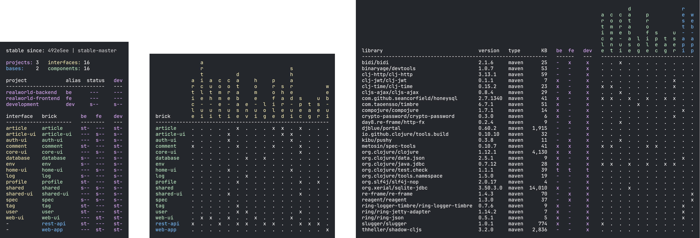
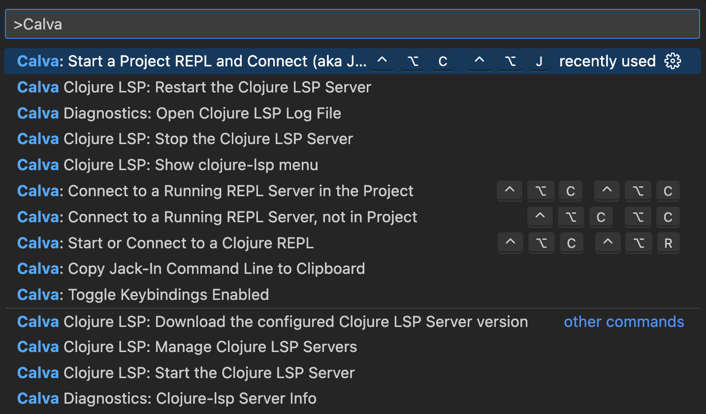
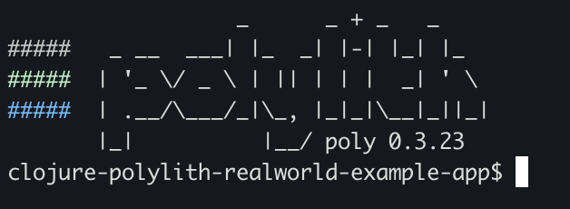
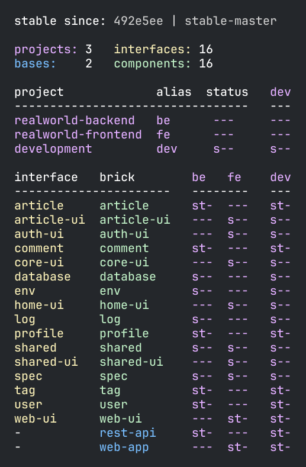
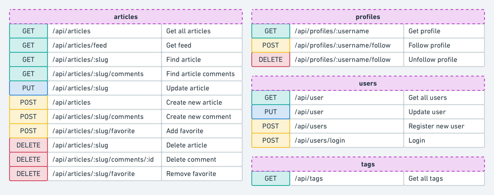

# 

A full-fledged [RealWorld](https://github.com/gothinkster/realworld) full-stack application (CRUD, auth, advanced patterns, etc) built with [Clojure](https://clojure.org), [Polylith](https://polylith.gitbook.io/), [Ring](https://github.com/ring-clojure/ring) for the backend API,
and [ClojureScript](https://clojurescript.org), [Polylith](https://polylith.gitbook.io/), [Re-frame](https://day8.github.io/re-frame/) for the frontend, including CRUD operations, authentication, routing, pagination, and more.



#### Build Status
[](https://dl.circleci.com/status-badge/redirect/gh/furkan3ayraktar/clojure-polylith-realworld-example-app/tree/master)

## Two quick ways to try this project

You can try both!

1. On your own machine, see below
2. In your browser using Gitpod, see [Hack on Real World Polylith in your Browser](gitpod.md)

There are many other ways too. But especially if your experience with Clojure is somewhat limited, the Gitpod variant is definitely an easy and quick one. You will have the development environment up and running in less than two minutes, without installing anything at all.

## Start a REPL in VSCode / Calva

1. Fork & clone this repo
2. Open the project in VSCode
    * [Install the Calva extension](https://calva.io/getting-started/#install-vs-code-and-calva) if you don't have it already.
3. Press F1 and select `Calva: Start a Project REPL and Connect (aka Jack-In)`
> 

Calva will start the Polylith REPL, connect it to the VSCode, start the RealWorld backend server at port 6003,
and launch the Shadow-CLJS frontend development server at port 3000 for you 💫

It will look something like this:

```bash
Jacking in...
Auto-selecting project type "Polylith RealWorld Server REPL (start)".
You can change this from settings:
  - See https://calva.io/connect-sequences/


Starting Jack-in: (cd /Users/tengstrand/source/clojure-polylith-realworld-example-app; npx shadow-cljs -d cider/cider-nrepl:0.55.4 watch realworld-frontend test)
Using host:port localhost:55151 ...
Hooking up nREPL sessions ...
Connected session: clj
Evaluating code from settings: 'calva.autoEvaluateCode.onConnect.clj'

; clj  shadow.user 
nil
Evaluating 'afterCLJReplJackInCode'
2025-08-19T06:30:47.126Z Mac INFO [clojure.realworld.rest-api.main] - Starting server on port:  6003
2025-08-19T06:30:47.134Z Mac INFO [clojure.realworld.log.config:77] - Initialized logging. Using console to print logs.
2025-08-19T06:30:47.341Z Mac INFO [clojure.realworld.rest-api.api] - Database schema is valid.
2025-08-19T06:30:47.341Z Mac INFO [clojure.realworld.rest-api.api] - Initialized server.

#object [org.eclipse.jetty.server.Server 0x18d9a28f "oejs.Server@18d9a28f{STARTED}[12.0.21,sto=0]"]
Creating cljs repl session...
Connecting cljs repl: Polylith RealWorld Server REPL (start)...
```

> (Optional) check [.vscode/settings.json](.vscode/settings.json) file to see what Calva does under the hood.

Now open http://localhost:3000 in your browser to test the app!

## Put the `poly` tool to your service

A convenient way to run the `poly` tool is to start a `shell`:
1. [Install](https://clojure.org/guides/install_clojure) the `clojure` command, if you haven't already.
2. Start a `poly` [shell](https://cljdoc.org/d/polylith/clj-poly/CURRENT/doc/shell), by executing `clojure -M:poly` from the workspace root (_clojure-polylith-realworld-example-app_).



From here we can execute different commands, e.g. the `info` command:
```sh
clojure-polylith-realworld-example-app$ info
```


For detailed information, see [Workspace Info](#workspace-info) section below.

## (Optional) Start it manually in your Clojure REPL

If you prefer not to use VSCode/Calva, you can start the project manually:

1. Fork & clone this repo (if not already done).
2. Open the workspace in your favorite Clojure editor
   - Open the workspace directory in your editor (Emacs, IntelliJ/IDEA, etc.)
   - Start a Clojure REPL with the project
     - From a development perspective, this is a regular `deps.edn` project
     - Make sure to include the `:dev` and `:test` aliases when starting the REPL
3. Start the backend server.
   - In the `dev.server` namespace, evaluate:
    ```clojure
    (start! 6003)
    ```
   - This will start the RealWorld backend API server on port 6003
   - You should see logs indicating the server is running
4. Start the frontend development server.
   - Open a new terminal window/tab
   - Navigate to the workspace root directory
   - Install npm dependencies (only needed once after cloning):
     ```bash
     npm install
     ```
   - Start the Shadow-CLJS development server:
     ```bash
     npx shadow-cljs watch realworld-frontend
     ```
   - Wait for the build to complete (you'll see "Build completed" message)

**Result:**
- Backend API available at http://localhost:6003
- Frontend application available at http://localhost:3000

## Table of Contents

- [Getting Started](#two-quick-ways-to-try-this-project)
- [General Structure](#general-structure)
  - [Project](#project)
  - [Base](#base)
  - [Components](#components)
- [Environment Variables](#environment-variables)
- [Database](#database)
- [Workspace Info](#workspace-info)
- [Check Workspace Integrity](#check-workspace-integrity)
- [Running Tests](#running-tests)
- [Stable Points](#stable-points)
- [Continuous Integration](#continuous-integration)
- [How to create this workspace from scratch](#how-to-create-this-workspace-from-scratch)
- [Steps required to use IntelliJ IDEA / Cursive](#steps-required-to-use-intellij-idea--cursive)


### General Structure
This project is structured according to Polylith Architecture principles. 
If you are not familiar with the Polylith architecture, please refer to its [documentation](https://polylith.gitbook.io/polylith) for further and deeper understanding.

The workspace is the root directory in a Polylith codebase, and is where we work with all our building blocks and projects. 
A workspace is usually version controlled in a monorepo, and contains all the building blocks, 
supplementary development sources, and projects.

The workspace structure looks like this:
```
▾ bases
  ▸ rest-api
  ▸ web-app
▾ components
  ▸ article
  ▸ article-ui
  ▸ auth-ui
  ▸ comment
  ▸ core-ui
  ▸ database
  ▸ env
  ▸ home-ui
  ▸ log
  ▸ profile
  ▸ shared
  ▸ shared-ui
  ▸ spec
  ▸ tag
  ▸ user
  ▸ web-ui
▸ development
▾ projects
  ▸ realworld-backend
  ▸ realworld-frontend
```

Components are the main building blocks in Polylith.
Bases are another kind of building blocks where the difference from components is that they expose a public API to the outside world.
Both bases and components are encapsulated blocks of code that can be assembled together into services and tools.
Components communicate to each other through their _interfaces_. 
The base in each project glues components together via their _interfaces_ and exposes the business logic via a public API.
In this project's case, the `rest-api` base provides a REST API for the backend, while the `web-app` base serves a web application for the frontend. 

There are two bases and two projects in this workspace.
The `rest-api` base provides the backend REST API, while the `web-app` base serves the frontend web application.
The `realworld-backend` project bundles the `rest-api` base with components and libraries for backend deployment.
The `realworld-frontend` project bundles the `web-app` base with components and libraries for frontend deployment.
The `development` project makes it delightful to develop both backend and frontend, from a single place.
You can run a REPL within the development project, start the Ring server for debugging or refactor the components easily by using your favorite IDE.

The Polylith tool also helps you run the tests incrementally.
If you run the poly `test` command from the workspace root directory, it will detect changes made since the last stable point in time (see [tagging](https://cljdoc.org/d/polylith/clj-poly/CURRENT/doc/tagging)) and only run tests for the recent changes (it will only run tests for .clj and .cljc files at the moment).
Please check out the [test section](https://cljdoc.org/d/polylith/clj-poly/CURRENT/doc/testing) of the _poly_ tool for further information about incremental testing or execute the [help](https://cljdoc.org/d/polylith/clj-poly/0.2.22/doc/reference/commands) command to see available commands.

##### Project
Projects in the Polylith architecture are configurations for deployable artifacts (explained in detail [here](https://cljdoc.org/d/polylith/clj-poly/0.2.22/doc/project)). 
There are two projects in this workspace: `realworld-backend` and `realworld-frontend`. 
Projects are a way to assemble a base with a set of components and libraries into deployable bundles. 
The `realworld-backend` project bundles the `rest-api` base with backend components for API deployment, while the `realworld-frontend` project bundles the `web-app` base with frontend components for web application deployment.

If you look at the directory `projects/realworld-backend`, you will see a standard `deps.edn` file. 
The magic here is the project's `deps.edn` file which refers to the sources, resources and tests of actual components and bases. 
A project only has its `deps.edn` file to define project specific configuration and external dependencies. 
All the code and resources in a project come from the components and the base, which creates the project.

## Backend

##### Base
Bases in Polylith architecture are the building blocks that expose a public API to the outside world.
The `rest-api` backend base exposes its functionality via a RESTful API. 
In order to achieve this, it uses Ring and [Compojure](https://github.com/weavejester/compojure). 
There are four namespaces under the `src` directory of `bases/rest-api`:
- `api.clj`
- `handler.clj`
- `main.clj`
- `middleware.clj`

The `api.clj` namespace contains route definitions for compojure and init function for Ring.
The REST API looks like this:



These routes are defined with compojure with this piece of code:
```clojure
(defroutes public-routes
  (OPTIONS "/**"                              [] h/options)
  (POST    "/api/users/login"                 [] h/login)
  (POST    "/api/users"                       [] h/register)
  (GET     "/api/profiles/:username"          [] h/profile)
  (GET     "/api/articles"                    [] h/articles)
  (GET     "/api/articles/:slug"              [] h/article)
  (GET     "/api/articles/:slug/comments"     [] h/comments)
  (GET     "/api/tag"                         [] h/tags))

(defroutes private-routes
  (GET     "/api/user"                        [] h/current-user)
  (PUT     "/api/user"                        [] h/update-user)
  (POST    "/api/profiles/:username/follow"   [] h/follow-profile)
  (DELETE  "/api/profiles/:username/follow"   [] h/unfollow-profile)
  (GET     "/api/articles/feed"               [] h/feed)
  (POST    "/api/articles"                    [] h/create-article)
  (PUT     "/api/articles/:slug"              [] h/update-article)
  (DELETE  "/api/articles/:slug"              [] h/delete-article)
  (POST    "/api/articles/:slug/comments"     [] h/add-comment)
  (DELETE  "/api/articles/:slug/comments/:id" [] h/delete-comment)
  (POST    "/api/articles/:slug/favorite"     [] h/favorite-article)
  (DELETE  "/api/articles/:slug/favorite"     [] h/unfavorite-article))
```

The `middleware.clj` namespace contains several useful middleware definitions for Ring, 
like adding CORS headers, wrapping exceptions and authorization. Middlewares in Ring are functions that are called before or after the execution of your handlers. For example, for authorization we can have a simple middleware like this:
```clojure
(defn wrap-authorization [handler]
  (fn [req]
    (if (:auth-user req)
      (handler req)
      {:status 401
       :body   {:errors {:authorization "Authorization required."}}})))
```
This middleware will check every request that it wraps and return an authorization error if it can't find `:auth-user` in the request.
Otherwise, it will execute the handler.

The `main.clj` namespace contains a main function to expose the REST API via a [Jetty](https://www.eclipse.org/jetty/) server.
If you look at the project configuration at `projects/realworld-backend/deps.edn` you'll notice that there are two aliases named `:aot` and `:uberjar`.
With the help of those two aliases and `main.clj`, we can create an uberjar which is a single jar file that can be run directly on any machine that has Java runtime.
Once the jar file is run, the main function defined in `main.clj` will be triggered and start the server.

The `web-app` base serves the frontend web application using ClojureScript and Re-frame.
It provides the user interface for the RealWorld application, including article management, user authentication, and profile features. 

Finally, the `handler.clj` namespace is the place where we define our handlers.
Since `rest-api` is the only place where our project exposes its functionality, its handler needs to call functions in different components via their `interfaces`.
If you check out the `:require` statements on top of the namespace, you'll see this:
```clojure
(ns clojure.realworld.rest-api.handler
  (:require [clojure.realworld.article.interface :as article]
            [clojure.realworld.comment.interface :as comment-comp]
            [clojure.realworld.spec.interface :as spec]
            [clojure.realworld.profile.interface :as profile]
            [clojure.realworld.tag.interface :as tag]
            [clojure.realworld.user.interface :as user]
            [clojure.spec.alpha :as s]))
```
Following the rules of the Polylith architecture means that `handler.clj` doesn't depend on anything except the interfaces of different components. An example handler for profile request can be written like this:
```clojure
(defn profile [req]
  (let [auth-user (-> req :auth-user)
        username  (-> req :params :username)]
    (if (s/valid? spec/username? username)
      (let [[ok? res] (profile/profile auth-user username)]
        (handler (if ok? 200 404) res))
      (handler 422 {:errors {:username ["Invalid username."]}}))))
```

##### Components
Components are the main building blocks in a Polylith architecture.
In this workspace, there are 16 different components, where 11 are used in this backend project. 
Let's take a deeper look at one of the interfaces, like `profile`. 
The interface of the `profile` component is split into two different files/namespaces.
One of them contains the exposed functions in the interface and the other one contains the exposed specs:
```clojure
(ns clojure.realworld.profile.interface
  (:require [clojure.realworld.profile.core :as core]))

(defn fetch-profile [auth-user username]
  (core/fetch-profile auth-user username))

(defn follow! [auth-user username]
  (core/follow! auth-user username))

(defn unfollow! [auth-user username]
  (core/unfollow! auth-user username))
```

```clojure
(ns clojure.realworld.profile.interface.spec
  (:require [clojure.realworld.profile.spec :as spec]))

(def profile spec/profile)
```

As you can see, the interfaces are just passing through to the real implementation encapsulated in the component.

One example of using these interfaces can be found under `handler.clj` namespace of `rest-api` base:  
```clojure
(ns clojure.realworld.rest-api.handler
  (:require ;;...
            [clojure.realworld.profile.interface :as profile]
            ;;...))
            
;;...

(defn follow-profile [req]
  (let [auth-user (-> req :auth-user)
        username  (-> req :params :username)]
    (if (s/valid? spec/username? username)
      (let [[ok? res] (profile/follow! auth-user username)]
        (handler (if ok? 200 404) res))
      (handler 422 {:errors {:username ["Invalid username."]}}))))
      
;;...
```

The function `profile/follow!` is called via the `profile` interface, which delegates
to the `follow!` function that lives in the `core` namespace inside the `profile` component:
```clojure
(defn follow! [auth-user username]
  (if-let [user (user/find-by-username-or-id username)]
    (do
      (store/follow! (:id auth-user) (:id user))
      [true (create-profile user true)])
    [false {:errors {:username ["Cannot find a profile with given username."]}}]))
```
Here is another function call to the `user` component from the `profile` component.
This is how the `user`'s interface looks: 
```clojure
(ns clojure.realworld.user.interface
  (:require [clojure.realworld.user.core :as core]
            [clojure.realworld.user.store :as store]))

(defn login! [login-input]
  (core/login! login-input))

(defn register! [register-input]
  (core/register! register-input))

(defn user-by-token [token]
  (core/user-by-token token))

(defn update-user! [auth-user user-input]
  (core/update-user! auth-user user-input))

(defn find-by-username-or-id [username-or-id]
  (store/find-by-username-or-id username-or-id))
```
`profile` uses `find-by-username-or-id` function from the `user` component. This is how different components talk to each other within the workspace.
It's only possible to call component functions via their `interface.clj`.

In the code example above, we can see that the interface functions redirect each function call to an actual implementation inside the component. 
By having an interface and an implementation of that interface, it is easy to compile, test, and build (as well as develop) components in isolation. 
This separation gives the system the ability to detect, test, and build only the changed parts of the workspace. 
It also gives the developer a better development experience locally, with support for IDE refactoring via the  development project.
You can read more about interfaces and their benefits [here](https://cljdoc.org/d/polylith/clj-poly/CURRENT/doc/interface).  

`article`, `comment`, `profile`, `tag`, and `user` components define functionality to endpoints required for the RealWorld backend.
The other components, `database`, `env`, `spec` and `log`, are created to encapsulate some other common code in the workspace.
`spec` component contains some basic spec definitions that are used in different components. 

Similarly, the `log` component creates a wrapper around the logging library [timbre](https://github.com/ptaoussanis/timbre). 
This is included in the workspace to demonstrate how to create wrapper components around external libraries. 
This gives you an opportunity to declare your own interface for an external library and if you decide to use another external library, 
you can just switch to another component implementing the same interface without affecting other components.

The `database` component is another type of common functionality component.
It contains schema definitions for the sqlite database and functions to apply that schema.
If you check Ring initializer function in `api.clj` namespace of `rest-api` base, you'll see this:
```clojure
(defn init []
  (try
    (log/init)
    (let [db (database/db)]
      (if (database/valid-schema? db)
        (log/info "Database schema is valid.")
        (if (database/db-exists?)
          (log/warn "Please fix database schema and restart")
          (do
            (log/info "Generating database.")
            (database/generate-db db)
            (log/info "Database generated.")))))
    (log/info "Initialized server.")
    (catch Exception e
      (log/error e "Could not start server."))))
```
Here, we use helper functions from the `database` component's `interface.clj` to check if an SQLite database exists in the current path and, if it does, to validate the schema. 
The interface for the `database` component looks like this:
```clojure
(ns clojure.realworld.database.interface
  (:require [clojure.realworld.database.core :as core]
            [clojure.realworld.database.schema :as schema]))

(defn db
  ([path]
   (core/db path))
  ([]
   (core/db)))

(defn db-exists? []
  (core/db-exists?))

(defn generate-db [db]
  (schema/generate-db db))

(defn drop-db [db]
  (schema/drop-db db))

(defn valid-schema? [db]
  (schema/valid-schema? db))
```

### Environment Variables
The following environment variables are used in the project. 
You can define these variables under the `env.edn` file for local development:

+ `:allowed-origins`
  + Comma separated string of origins. Used to whitelist origins for CORS.
+ `:environment`
  + Defines current environment. Currently used for logging. If set to LOCAL, logs are printed to console.
+ `:database`
  + Defaults to `database.db`. If provided, it will be the name of the file that contains the SQLite database.
+ `:secret`
  + Secret for JWT token generation.

### Database
The project uses an SQLite database to make it easy to run. 
It can easily be changed to another SQL database by editing the database connection and changing to a real JDBC dependency. 
There is an existing database under the development project, ready to be used.
If you want to start from scratch, you can delete `database.db` and start the server again. 
It will generate a database with correct schema on start.
The project also checks if the schema is valid or not, and prints out proper logs for each case.

## Frontend

##### Base
The `web-app` base serves the frontend web application using [ClojureScript](https://clojurescript.org) and [Re-frame](https://day8.github.io/re-frame).
It provides the user interface for the RealWorld application, including article management, user authentication, and profile features.

There is one key namespace under the `src` directory of `bases/web-app`:
- `main.cljs` - Entry point that initializes the Re-frame application and starts the router

The `main.cljs` namespace initializes the Re-frame application, sets up the database, and starts the client-side router.
It serves as the entry point for the frontend application and coordinates the startup of all UI components.

##### UI Components
The frontend is built using several specialized UI components that follow Polylith principles:

- **`core-ui`** - Core application logic, routing, and state management
- **`shared-ui`** - Reusable UI components like header, footer, and article displays
- **`auth-ui`** - Authentication-related views (login, register, settings)
- **`home-ui`** - Home page with article feeds and navigation
- **`article-ui`** - Article creation, editing, and management views

Each UI component communicates through well-defined interfaces and manages its own local state while sharing global state through Re-frame's app-db.

##### Frontend Architecture
The frontend uses a modern ClojureScript stack:

- [Re-frame](https://day8.github.io/re-frame) for state management and event handling
- [shadow-cljs](https://github.com/thheller/shadow-cljs) for build tooling and development server
- [Bidi](https://github.com/juxt/bidi) for client-side routing
- [Pushy](https://github.com/kibu-australia/pushy) for browser history management

The application follows a unidirectional data flow where:
1. User interactions trigger events
2. Events update the application state
3. State changes trigger UI re-renders
4. Subscriptions provide reactive data to views

##### UI Component Details
Each UI component is designed as a self-contained unit with specific responsibilities:

**`core-ui` Component**
- **Purpose**: Central application logic and state management
- **Key Functions**: 
  - Global state management via Re-frame app-db
  - Event handling for application-wide actions
  - Router management and navigation state
  - User authentication state and session management
- **Architecture**: Acts as the "brain" of the frontend, coordinating between all other components

**`shared-ui` Component**
- **Purpose**: Reusable UI elements used across multiple pages
- **Key Components**:
  - Header with navigation and user menu
  - Footer with application information
  - Article display components (meta, content, actions)
  - Common form elements and buttons
- **Design Principle**: Single source of truth for consistent UI patterns

**`auth-ui` Component**
- **Purpose**: User authentication and account management
- **Key Views**:
  - Login form with validation
  - Registration form with user creation
  - Settings page for profile updates
  - Password change functionality
- **State Management**: Handles user credentials, authentication tokens, and profile data

**`home-ui` Component**
- **Purpose**: Main landing page and article discovery
- **Key Features**:
  - Global feed of all articles
  - User-specific feed (for authenticated users)
  - Article filtering and pagination
  - Tag-based navigation
- **Data Flow**: Fetches articles from backend API and manages feed state

**`article-ui` Component**
- **Purpose**: Article creation, editing, and detailed viewing
- **Key Functionality**:
  - Article editor with rich text support
  - Article detail view with comments
  - Favorite/unfavorite actions
  - Article management (create, edit, delete)
- **Integration**: Works closely with `shared-ui` for article display components

Each component follows Polylith principles:
- **Clear interfaces** for inter-component communication
- **Isolated state** where possible, shared state where necessary
- **Reusable logic** through well-defined event handlers
- **Testable architecture** with clear separation of concerns

### poly CLI crash course

##### Workspace info
If you still have a [shell](https://cljdoc.org/d/polylith/clj-poly/CURRENT/doc/shell) running (that you started with `clojure -M:poly`) you can now execute the [info](https://cljdoc.org/d/polylith/clj-poly/CURRENT/doc/reference/commands#info) command again:
```
clojure-polylith-realworld-example-app$ info
```


If a component, base, or project is changed, it will be marked with an asterisk (*).
How modified files are detected and displayed is described in detail [here](https://cljdoc.org/d/polylith/clj-poly/CURRENT/doc/tagging#make-a-change).

##### Check workspace integrity
In order to guarantee workspace integrity, which means all components refer to each other through their interfaces,
the Polylith tool provides you with the [check](https://cljdoc.org/d/polylith/clj-poly/CURRENT/doc/reference/commands#check) command that will check the entire workspace and print out errors and/or warnings, if any.
The [info](https://cljdoc.org/d/polylith/clj-poly/CURRENT/doc/reference/commands#info) command can be used for the same purpose, because it will also perform the `check` internally and show the same information after the `info` table.

##### Run tests
At the time of writing, the internal [test runner](https://cljdoc.org/d/polylith/clj-poly/CURRENT/doc/test-runners) and other external test runners only support Clojure (.clj + .cljc files).
If we run the [test](https://cljdoc.org/d/polylith/clj-poly/CURRENT/doc/reference/commands#test) command, it will only run tests for the backend project:
```
Projects to run tests from: realworld-backend, realworld-frontend

Running tests for the realworld-backend project using test runner: Polylith built-in clojure.test runner...
Running tests from the realworld-backend project, including 6 bricks: article, comment, profile, tag, user, rest-api

Testing clojure.realworld.article.core-test
SLF4J(W): No SLF4J providers were found.
SLF4J(W): Defaulting to no-operation (NOP) logger implementation
SLF4J(W): See https://www.slf4j.org/codes.html#noProviders for further details.

Ran 20 tests containing 53 assertions.
0 failures, 0 errors.

Test results: 53 passes, 0 failures, 0 errors.

...

No tests to run for the realworld-frontend project using test runner: Polylith built-in clojure.test runner.
```

##### Stable points in time
Once you check the integrity of your workspace and see that all tests are green, you can commit your changes to your git repository and add (or move if there is one already) a git tag that starts with `stable-` prefix.
The Polylith tool will use this point in time to calculate what changes have been made.
You can easily add this logic to your continuous integration pipeline as a way to automate it.
Read more about stable points [here](https://cljdoc.org/d/polylith/clj-poly/CURRENT/doc/tagging) where you can find
an example of how to implement CI pipeline in the section below.

### Continuous integration
This repository has a [CircleCI](https://circleci.com) configuration to demonstrate how to use the Polylith tool to incrementally run tests and build artifacts. 
The CircleCI configuration file is located at `.circleci/config.yml`.

The CircleCI workflow for this project consists of six steps to demonstrate different commands from the Polylith tool. 
You can achieve the same result with fewer steps once you have learned the commands. The current steps are:

- check
  - This job runs the check command from Polylith as follows: `clojure -M:poly check`. If there are any errors in the Polylith workspace, it returns with a non-zero exit code and the CircleCI workflow stops at this stage. 
  If there are any warnings printed by Polylith, it will be visible in the job's output.
- info
  - Prints useful information about the current state of the workspace. This job runs the following commands, one after another:
    - `clojure -M:poly ws`
      - Prints the current workspace as data in [edn format](https://github.com/edn-format/edn).
    - `clojure -M:poly info`
      - Prints workspace information.
    - `clojure -M:poly deps`
      - Prints the dependency information
    - `clojure -M:poly libs`
      - Prints all libraries that are used in the workspace.
  - After this job is done, all this information will be available in the jobs output for debugging purposes if needed.
    You can read more about available commands [here](https://cljdoc.org/d/polylith/clj-poly/CURRENT/doc/reference/commands).
- test
  - This job runs all the tests for all the bricks and projects that are directly or indirectly changed since the last stable point in time. 
    Polylith supports incremental testing out of the box by using stable point marks in the git history. 
    It runs the following command: `clojure -M:poly test :project`. 
    If any of the tests fail, it will exit with a non-zero exit code and the CircleCI workflow stops at this stage. 
    Information about the passed/failed tests will be printed in the job's output.
- api-test
  - Runs end-to-end API tests using a [Postman](https://www.postman.com) collection defined under the `api-tests` directory. 
    Before running the tests, start the backend service by executing the `clojure -M:ring` statement under `projects/realworld-backend` directory.
- build-uberjar
  - This job creates an AOT compiled uberjar for the realworld-backend project. The created artifact can be found in the artifacts section of this job's output.
- mark-as-stable
  - This job only runs for the commits made to the master branch. 
    It adds (or moves if there is already one) the `stable-master` tag to the repository. 
    At this point in the workflow, it is proven that the Polylith workspace is valid and that all the tests have passed. 
    It is safe to mark this commit as stable.
    It does that by running the following commands one after another:
    - `git tag -f -a "stable-$CIRCLE_BRANCH" -m "[skip ci] Added Stable Polylith tag"`
      - Creates or moves the tag
    - `git push origin $CIRCLE_BRANCH --tags --force`
      - Pushes the tag back to the git repository

### How to create this workspace from scratch
You can find necessary steps to create this workspace with Polylith plugin [here](how-to.md).

### Steps required to use IntelliJ IDEA / Cursive
You can find necessary steps to make this project work in [Intellij IDEA](https://www.jetbrains.com/idea/) / [Cursive](https://cursive-ide.com) plugin [here](https://cursive-ide.com/userguide/polylith.html).

### Note about deps.edn vs Leiningen

> This version uses [tools.deps](https://github.com/clojure/tools.deps).
  There is also an older version of this project that uses [Leiningen](https://leiningen.org/) on the [leiningen branch](https://github.com/furkan3ayraktar/clojure-polylith-realworld-example-app/tree/leiningen).

## License

Distributed under the [The MIT License](https://opensource.org/licenses/MIT), the same as [RealWorld](https://github.com/gothinkster/realworld) project.
