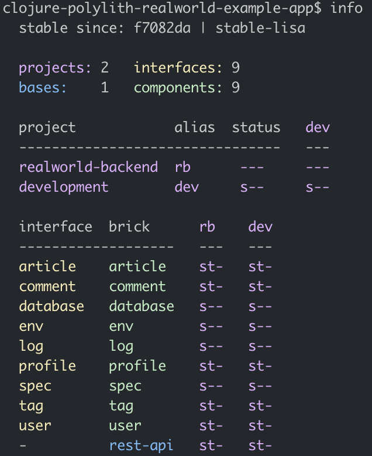

# 

> ### Clojure, Polylith and Ring codebase containing real world examples (CRUD, auth, advanced patterns, etc) that adheres to the [RealWorld](https://github.com/gothinkster/realworld-example-apps) spec and API.


### [RealWorld](https://github.com/gothinkster/realworld)


This codebase was created to demonstrate a fully fledged fullstack application built with **Clojure, Polylith and Ring** including CRUD operations, authentication, routing, pagination, and more.

We've gone to great lengths to adhere to the **Clojure** community styleguides & best practices.

For more information on how this works with other frontends/backends, head over to the [RealWorld](https://github.com/gothinkster/realworld) repo.

> This version uses [tools.deps](https://github.com/clojure/tools.deps.alpha). There is also an older version of this project that uses [Leiningen](https://leiningen.org/) on the [leiningen branch](https://github.com/furkan3ayraktar/clojure-polylith-realworld-example-app/tree/leiningen).

#### Build Status
[](https://circleci.com/gh/furkan3ayraktar/clojure-polylith-realworld-example-app/tree/master)

## Table of Contents

- [Getting Started](#getting-started)
- [General Structure](#general-structure)
  - [Project](#project)
  - [Base](#base)
  - [Components](#components)
- [Environment Variables](#environment-variables)
- [Database](#database)
- [Workspace Info](#workspace-info)
- [Check Workspace Integrity](#workspace-info)
- [Running Tests](#running-tests)
- [Stable Points](#stable-points)
- [Continuous Integration](#continuous-integration)
- [How to create this workspace from scratch](#how-to-create-this-workspace-from-scratch)

### Getting started

Just a few steps to have you up and running locally:

+ Install [Polylith tool](https://github.com/polyfy/polylith#installation)
+ Clone this repo
+ Open a terminal, navigate to the root directory of this repo and run ``clj -A:ring realworld-backend``

and the Realworld backend is up on port 6003!

### General Structure
This project is structured according to Polylith Architecture principles. If you are not familiar with Polylith Architecture, please refer to its [documentation](https://polylith.gitbook.io/polylith) for further and deeper understanding.

The workspace is the root directory in a Polylith codebase, and it's where we work with all our building blocks and projects. A workspace is usually version controlled in a monorepo, and its subdirectories looks like this:

The root directory contains all the building blocks, supplementary development sources, and projects. The subdirectories of the workspace look like this:
```
▾ bases
  ▸ rest-api
▾ components
  ▸ article
  ▸ comment
  ▸ database
  ▸ env
  ▸ log
  ▸ profile
  ▸ spec
  ▸ tag
  ▸ user
▸ development
▾ projects
  ▸ realworld-backend
```

Components are the main building blocks in Polylith. Bases are another kind of building blocks where the difference from components are that they expose a public API to the outside world. Both bases and components are encapsulated blocks of code that can be assembled together into services, libraries or tools. Components communicate to each other through their 'interfaces'. A base in each project glue components together via their 'interfaces' and expose the business logic via a public API, in this project's case, a REST api. 

There is only one base and one project in this workspace to make it simple. The project named 'realworld-backend' bundles the base, components and libraries together. The development project makes it delightful to develop from one single place. You can run a REPL within the development project, start the Ring server for debugging or refactor the components easily with using your favorite IDE (mine is Intellij IDEA with [Cursive](https://cursive-ide.com) plugin).

Polylith tool also helps to run tests incrementally. If you run `` poly test `` command on the root directory, it will detect changes made since the last stable point and only run tests for the recent changes. [Check out Polylith tool](https://github.com/polyfy/polylith#testing) for further information about incremental testing or simply write `` poly help `` to see available commands.

##### Project
Projects in Polylith architecture are configurations for deployable artifacts. There is only one project in this workspace, which is called `` realworld-backend ``. Projects are a way to define a base, a set of components and libraries to deliver within a bundle. Since we only need to deliver one bundle for realworld backend, we have only one project.

If you look at the directory `` projects/realworld-backend ``, you will see a standard ``deps.edn`` file. The magic here is, the `` deps.edn `` file of the project refers to the sources, resources and tests of actual components and bases. A project only has it's `` deps.edn `` file to define project specific configuration and external dependencies. All the code and resources in a project come from the components and the base, which creates the project.

##### Base
Bases in Polylith architecture are the building blocks that exposes a public API to the outside world and `` rest-api `` is the only base in our workspace. As hinted in its name, it exposes its functionality via a RESTful API. In order to achieve this, it uses Ring and [Compojure](https://github.com/weavejester/compojure). There are 4 namespaces under the `` src `` directory of `` bases/rest-api ``:
- `` api.clj ``
- `` handler.clj ``
- `` main.clj ``
- `` middleware.clj``

The `` api.clj `` namespace contains route definitions for compojure and init function for Ring. The REST API looks like this:


These routes are defined with compojure with this piece of code:
```clojure
(defroutes public-routes
  (OPTIONS "/**"                              [] h/options)
  (POST    "/api/users/login"                 [] h/login)
  (POST    "/api/users"                       [] h/register)
  (GET     "/api/profiles/:username"          [] h/profile)
  (GET     "/api/articles"                    [] h/articles)
  (GET     "/api/articles/:slug"              [] h/article)
  (GET     "/api/articles/:slug/comments"     [] h/comments)
  (GET     "/api/tag"                         [] h/tags))

(defroutes private-routes
  (GET     "/api/user"                        [] h/current-user)
  (PUT     "/api/user"                        [] h/update-user)
  (POST    "/api/profiles/:username/follow"   [] h/follow-profile)
  (DELETE  "/api/profiles/:username/follow"   [] h/unfollow-profile)
  (GET     "/api/articles/feed"               [] h/feed)
  (POST    "/api/articles"                    [] h/create-article)
  (PUT     "/api/articles/:slug"              [] h/update-article)
  (DELETE  "/api/articles/:slug"              [] h/delete-article)
  (POST    "/api/articles/:slug/comments"     [] h/add-comment)
  (DELETE  "/api/articles/:slug/comments/:id" [] h/delete-comment)
  (POST    "/api/articles/:slug/favorite"     [] h/favorite-article)
  (DELETE  "/api/articles/:slug/favorite"     [] h/unfavorite-article))
```

The `` middleware.clj `` namespace contains several useful middleware definitions for ring, like adding CORS headers, wrapping exceptions and authorization. Middlewares in Ring are functions that are called before or after the execution of your handlers. For example, for authorization we can have a simple middleware like this:
```clojure
(defn wrap-authorization [handler]
  (fn [req]
    (if (:auth-user req)
      (handler req)
      {:status 401
       :body   {:errors {:authorization "Authorization required."}}})))
```
This middleware will check every request that it wraps and return an authorization error if it can't find `` :auth-user `` in the request. Otherwise, it will execute the handler.

The `` main.clj `` namespace contains a main function to expose the REST API via a [Jetty](https://www.eclipse.org/jetty/) server. If you look at the project configuration at `` projects/realworld-backend/deps.edn `` you'll notice that there are two aliases named `` :aot `` and `` :uberjar ``. With the help of those two aliases and `` main.clj ``, we can create an uberjar which is a single jar file that can be run directly on any machine that has Java runtime. Once the jar file is run, the main function defined under `` main.clj `` will be triggered and it will start the server. 

Finally, the `` handler.clj `` namespace is the place where we define our handlers. Since `` rest-api `` is the only place where our project exposes its functionality, its handler needs to call functions in different components via their `` interfaces ``. If you check out the `` :require `` statements on top of the namespace, you'll see this:
```clojure
(ns clojure.realworld.rest-api.handler
  (:require [clojure.realworld.article.interface :as article]
            [clojure.realworld.comment.interface :as comment-comp]
            [clojure.realworld.spec.interface :as spec]
            [clojure.realworld.profile.interface :as profile]
            [clojure.realworld.tag.interface :as tag]
            [clojure.realworld.user.interface :as user]
            [clojure.spec.alpha :as s]))
```
Following the rules of the Polylith architecture means that `` handler.clj `` does not depend on anything except the interfaces of different components. An example handler for profile request can be written like this:
```clojure
(defn profile [req]
  (let [auth-user (-> req :auth-user)
        username  (-> req :params :username)]
    (if (s/valid? spec/username? username)
      (let [[ok? res] (profile/profile auth-user username)]
        (handler (if ok? 200 404) res))
      (handler 422 {:errors {:username ["Invalid username."]}}))))
```

##### Components
Components are the main building blocks in Polylith architecture. In this workspace, there are 9 different components. Let's take a deeper look at one of the interfaces, like `` profile ``. The interface of `` profile `` component is split into two different files. One of them contains the function interfaces and the other one contains the exposed specs.
```clojure
(ns clojure.realworld.profile.interface
  (:require [clojure.realworld.profile.core :as core]))

(defn fetch-profile [auth-user username]
  (core/fetch-profile auth-user username))

(defn follow! [auth-user username]
  (core/follow! auth-user username))

(defn unfollow! [auth-user username]
  (core/unfollow! auth-user username))
```

```clojure
(ns clojure.realworld.profile.interface.spec
  (:require [clojure.realworld.profile.spec :as spec]))

(def profile spec/profile)
```

As you can see in above code examples, interfaces are just passing through to the real implemantation encapsulated in the component.

One example of using these interfaces can be found under `` handler.clj `` namespace of `` rest-api `` base.  
```clojure
(ns clojure.realworld.rest-api.handler
  (:require ;;...
            [clojure.realworld.profile.interface :as profile]
            ;;...))
            
;;...

(defn follow-profile [req]
  (let [auth-user (-> req :auth-user)
        username  (-> req :params :username)]
    (if (s/valid? spec/username? username)
      (let [[ok? res] (profile/follow! auth-user username)]
        (handler (if ok? 200 404) res))
      (handler 422 {:errors {:username ["Invalid username."]}}))))
      
;;...
```

`` handler.clj `` uses function signature `` profile/follow! `` from `` profile `` components interface. If we continue to follow looking at this functionality, the actual definition of `` follow! `` function under `` core.clj `` namespace of `` profile `` component. 
```clojure
(defn follow! [auth-user username]
  (if-let [user (user/find-by-username-or-id username)]
    (do
      (store/follow! (:id auth-user) (:id user))
      [true (create-profile user true)])
    [false {:errors {:username ["Cannot find a profile with given username."]}}]))
```
Here we see another function call to `` user `` component from `` profile `` component. We can take a look at `` user ``s interface: 
```clojure
(ns clojure.realworld.user.interface
  (:require [clojure.realworld.user.core :as core]
            [clojure.realworld.user.store :as store]))

(defn login! [login-input]
  (core/login! login-input))

(defn register! [register-input]
  (core/register! register-input))

(defn user-by-token [token]
  (core/user-by-token token))

(defn update-user! [auth-user user-input]
  (core/update-user! auth-user user-input))

(defn find-by-username-or-id [username-or-id]
  (store/find-by-username-or-id username-or-id))
```
`` profile `` uses `` find-by-username-or-id `` function from `` user `` component. This is how different components talk to each other within the workspace. You are forced to call other components' functions defined in their `` interface.clj `` from any component or base.

In the code example above, we see that the interface functions direct each function call to an actual implementation inside the component. By having an interface and an implementation of that interface, it is easy to compile/test/build (as well as develop) components in isolation. This separation gives it ability to detect/test/build only changed parts of the workspace. It also gives the developer a better development experience on local, with support of IDE refactoring through development project. You can read more about interfaces and their benefits [here](https://github.com/polyfy/polylith#interface).  

`` article ``, `` comment ``, `` profile ``, `` tag ``, and `` user `` components define functionality to endpoints required for realworld backend. The other components, `` database ``, `` env ``, `` spec `` and `` log ``, are created to isolate some other common code in the workspace. `` spec `` component contains some basic spec definitions that are used in different components. Similarly, `` log `` component creates a wrapper around logging library, [timbre](https://github.com/ptaoussanis/timbre). This is included in the workspace to demonstrate how to create wrapper components around external libraries. This gives you an opportunity to declare your own interface for an external library and if you decide to use another external library, you can just switch to another component implementing the same interface without effecting other components.

`` database `` component is another type of common functionality component. It contains schema definitions for the sqlite database and functions to apply that schema. If you check Ring initializer function in `` api.clj `` namespace of `` rest-api `` base, you'll see this:
```clojure
(defn init []
  (try
    (log/init)
    (let [db (database/db)]
      (if (database/valid-schema? db)
        (log/info "Database schema is valid.")
        (if (database/db-exists?)
          (log/warn "Please fix database schema and restart")
          (do
            (log/info "Generating database.")
            (database/generate-db db)
            (log/info "Database generated.")))))
    (log/info "Initialized server.")
    (catch Exception e
      (log/error e "Could not start server."))))
```
Here, we use helper functions from `` database `` components `` interface.clj `` to check if an sqlite database exists in the current path and if it exists, to check the validity of schema. The interface of `` database `` component looks like this:
```clojure
(ns clojure.realworld.database.interface
  (:require [clojure.realworld.database.core :as core]
            [clojure.realworld.database.schema :as schema]))

(defn db
  ([path]
   (core/db path))
  ([]
   (core/db)))

(defn db-exists? []
  (core/db-exists?))

(defn generate-db [db]
  (schema/generate-db db))

(defn drop-db [db]
  (schema/drop-db db))

(defn valid-schema? [db]
  (schema/valid-schema? db))
```

### Environment Variables
The following environment variables are used in the project. You can define these variables under env.edn file for local development.

+ `` :allowed-origins ``
  + Comma separated string of origins. Used to whitelist origins for CORS.
+ `` :environment ``
  + Defines current environment. Currently used for logging. If set to LOCAL, logs printed to console.
+ `` :database ``
  + Defaults to database.db. If provided, it will be the name of the file that contains SQLite database.
+ `` :secret ``
  + Secret for JWT token.

### Database
The project uses a SQLite database to make it easy to run. It can be changed easily to other sql databases by editing database connection and changing to a real jdbc dependency. There is an existing database under development project, ready to use. If you want to start from scratch, you can delete database.db and start the server again. It will generate a database with correct schema on start. The project also checks if the schema is valid or not, and prints out proper logs for each case.

### Workspace info
Run following command in the root directory to print out workspace information and changes since the last stable point:
`` poly info ``

This command will print an output like below. Here you can see that changed components are marked with a * symbol. Refer to the [Polylith tool documentation](https://github.com/polyfy/polylith/blob/master/doc/commands.md#info) for more detailed information about this command and other commands that Polylith provides.



### Check workspace integrity
In order to guarantee workspace integrity, which means each component refers to each other by only using their interfaces, Polylith tool provides a convenient command. You can run `` poly check `` anytime in the root directory of the workspace. The Polylith tool will check the entire workspace and print out errors and/or warnings, if any.

### Running tests
Run following command in the root directory:
`` poly test ``

This command will run all the tests for changed components and other components that are effected from the current changes. You can read more about test command [here](https://github.com/polyfy/polylith/blob/master/doc/commands.md#test) and [here](https://github.com/polyfy/polylith#testing).

### Stable points
Once you check the integrity of your workspace and see that all tests are green, you can commit your changes to your git repository and add (or move if there is one already) a git tag that starts with ``stable-`` prefix. This way, Polylith tool will understand that the commit specified by the git tag is a stable point and it should calculate changes since that point. You can easily add this logic to your continuous integration pipeline in order to not do it manually. You can read more about stable points [here](https://github.com/polyfy/polylith#tagging) and you can see an example of how to implement the stable logic with CI in the section below. 

### Continuous integration
This repository has a [CircleCI](https://circleci.com) configuration to demonstrate how to use Polylith plugin to incrementally run tests and build artifacts. You can find CircleCI configuration file at `` .circleci/config.yml ``.

The CircleCI workflow for this project consists of 6 steps to demonstrate different commands from Polylith tool. You can also achieve same functionality with less number of steps once you learned the commands. The current steps are:

- check
  - This job runs the check command from Polylith as follows: ```clojure -A:poly check```. If there are any errors in the Polylith workspace, it returns with a non-zero exit code and the CircleCI workflow stops at this stage. If there are any warnings printed by Polylith, it will be visible in the job's output.
- info
  - Prints useful information about the current state of the workspace. This job runs the following commands one after another:
    - ```clojure -A:poly ws```
      - Prints the current workspace as data in [edn format](https://github.com/edn-format/edn).
    - ```clojure -A:poly info```
      - Prints workspace information.
    - ```clojure -A:poly deps```
      - Prints the dependency information
    - ```clojure -A:poly libs```
      - Prints all libraries that are used in the workspace.
  - After this job is done, all this information will be available in the jobs output for debugging purposes if needed. You can read more about available commands [here](https://github.com/polyfy/polylith/blob/master/doc/commands.md).
- test
  - This job runs all the tests for all the bricks and projects that are directly or indirectly changed since the last stable point. Polylith supports incremental testing out of the box by using stable point marks in the git history. It runs the following command: ```clojure -A:poly test :project```. If any of the tests fail, it will exit with a non-zero exit code and the CircleCI workflow stops at this stage. Information about the passed/failed tests will be printed in the job's output.
- api-test
  - Runs end-to-end API tests using a [Postman](https://www.postman.com) collection defined under `` api-tests `` directory. Before running tests, starts the backend service by running `` clojure -A:ring realworld-backend `` command.
- build-uberjar
  - This job creates an aot compiled uberjar for the realworld-backend project. Created artifact can be found in the artifacts section of this job's output.
- mark-as-stable
  - This job only runs for the commits made to master branch. It adds (or moves if there is already one) the `stable-master` tag to the repository. At this point in the workflow, it is proven that the Polylith workspace is valid and all of the tests are passed. It is safe to mark this commit as stable. It does that by running following commands one after another:
    - ```git tag -f -a "stable-$CIRCLE_BRANCH" -m "[skip ci] Added Stable Polylith tag"```
      - Creates or moves the tag
    - ```git push origin $CIRCLE_BRANCH --tags --force```
      - Pushed tag back to the git repository

### How to create this workspace from scratch
You can find necessary steps to create this workspace with Polylith plugin [here](how-to.md).
