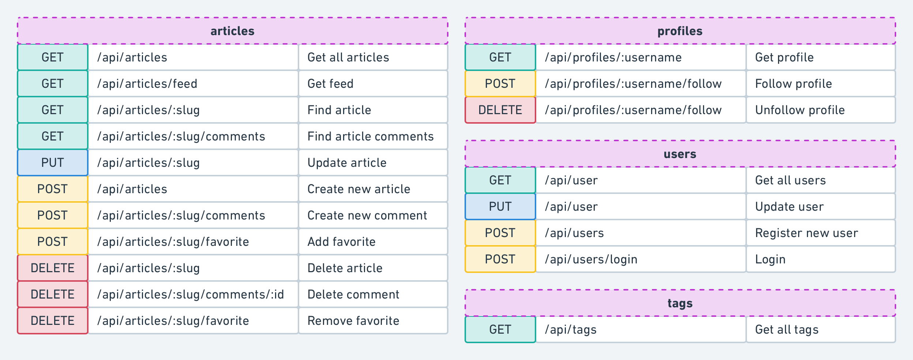

# 

A full-fledged [RealWorld](https://github.com/gothinkster/realworld) server (CRUD, auth, advanced patterns, etc) built with [Clojure](https://clojure.org), [Polylith](https://polylith.gitbook.io/), and [Ring](https://github.com/ring-clojure/ring), including CRUD operations, authentication, routing, pagination, and more.

#### Build Status
[](https://circleci.com/gh/furkan3ayraktar/clojure-polylith-realworld-example-app/tree/master)

## Start it in your Clojure REPL

1. Fork & clone this repo
1. Open the project in your favorite Clojure editor, start the project, and connect the REPL. From a development perspective it is a regular `deps.edn` project. Just make sure to include the `:dev` and `:test` aliases, and you should be good.
1. In the `dev.server` namespace, evaluate:
    ```clojure
    (start! 6003)
    ```

Now the Polylith RealWorld backend is up on port 6003!

### Test it with a RealWorld Frontend

A sweet way to put the sever to some tests is to fork the [re-frame RealWorld frontend by Jacek Schae](https://github.com/jacekschae/conduit) and modify it to run against this server by editing the definition of `api-url` in `src/conduit/events.cljs` to be:

```clojure
(def api-url "http://localhost:6003/api")
```

Then start the frontend and open http://localhost:3000/ in a web browser.

## Put the `poly` command to your service

1. Install the [Polylith tool](https://polylith.gitbook.io/poly/install/install)
2. Get ”at a glance" info about the project:
    ```sh
    $ poly info
    ```   
(See [Workspace Info](#workspace-info) below.)

## Table of Contents

- [Getting Started](#start-it-in-your-clojure-repl)
- [General Structure](#general-structure)
  - [Project](#project)
  - [Base](#base)
  - [Components](#components)
- [Environment Variables](#environment-variables)
- [Database](#database)
- [Workspace Info](#workspace-info)
- [Check Workspace Integrity](#check-workspace-integrity)
- [Running Tests](#running-tests)
- [Stable Points](#stable-points)
- [Continuous Integration](#continuous-integration)
- [How to create this workspace from scratch](#how-to-create-this-workspace-from-scratch)


### General Structure
This project is structured according to Polylith Architecture principles. 
If you are not familiar with Polylith Architecture, please refer to its [documentation](https://polylith.gitbook.io/polylith) for further and deeper understanding.

The workspace is the root directory in a Polylith codebase, and is where we work with all our building blocks and projects. 
A workspace is usually version controlled in a monorepo, and contains all the building blocks, 
supplementary development sources, and projects. The subdirectories of the workspace looks like this:
```
▾ bases
  ▸ rest-api
▾ components
  ▸ article
  ▸ comment
  ▸ database
  ▸ env
  ▸ log
  ▸ profile
  ▸ spec
  ▸ tag
  ▸ user
▸ development
▾ projects
  ▸ realworld-backend
```

Components are the main building blocks in Polylith. Bases are another kind of building blocks where the difference from components is that they expose a public API to the outside world. Both bases and components are encapsulated blocks of code that can be assembled together into services, libraries or tools. Components communicate to each other through their 'interfaces'. 
The base in each project, glue components together via their 'interfaces' and expose the business logic via a public API, in this project's case, a REST API. 

There is only one base and one project in this workspace to keep it simple. The project named 'realworld-backend' bundles the base, components and libraries together. The development project makes it delightful to develop from one single place. You can run a REPL within the development project, start the Ring server for debugging or refactor the components easily by using your favorite IDE (mine is Intellij IDEA with [Cursive](https://cursive-ide.com) plugin).

The Polylith tool also helps you run the tests incrementally. If you run the `` poly test `` command from the root directory, it will detect changes made since the last stable point in time, and only run tests for the recent changes. [Check out Polylith tool](https://github.com/polyfy/polylith#testing) for further information about incremental testing or simply write `` poly help `` to see available commands.

##### Project
Projects in the Polylith architecture are configurations for deployable artifacts. 
There is only one project in this workspace, which is called `` realworld-backend ``. 
Projects are a way to define a base, a set of components and libraries to deliver within a bundle. 
Since we only need to deliver one bundle for realworld backend, we have only one project.

If you look at the directory `` projects/realworld-backend ``, you will see a standard ``deps.edn`` file. 
The magic here is the project's `` deps.edn `` file which refers to the sources, resources and tests of actual components and bases. 
A project only has it's `` deps.edn `` file to define project specific configuration and external dependencies. 
All the code and resources in a project come from the components and the base, which creates the project.

##### Base
Bases in Polylith architecture are the building blocks that expose a public API to the outside world and `` rest-api `` is the only base in our workspace. 
As hinted in its name, it exposes its functionality via a RESTful API. 
In order to achieve this, it uses Ring and [Compojure](https://github.com/weavejester/compojure). 
There are four namespaces under the `` src `` directory of `` bases/rest-api ``:
- `` api.clj ``
- `` handler.clj ``
- `` main.clj ``
- `` middleware.clj``

The `` api.clj `` namespace contains route definitions for compojure and init function for Ring. The REST API looks like this:



These routes are defined with compojure with this piece of code:
```clojure
(defroutes public-routes
  (OPTIONS "/**"                              [] h/options)
  (POST    "/api/users/login"                 [] h/login)
  (POST    "/api/users"                       [] h/register)
  (GET     "/api/profiles/:username"          [] h/profile)
  (GET     "/api/articles"                    [] h/articles)
  (GET     "/api/articles/:slug"              [] h/article)
  (GET     "/api/articles/:slug/comments"     [] h/comments)
  (GET     "/api/tag"                         [] h/tags))

(defroutes private-routes
  (GET     "/api/user"                        [] h/current-user)
  (PUT     "/api/user"                        [] h/update-user)
  (POST    "/api/profiles/:username/follow"   [] h/follow-profile)
  (DELETE  "/api/profiles/:username/follow"   [] h/unfollow-profile)
  (GET     "/api/articles/feed"               [] h/feed)
  (POST    "/api/articles"                    [] h/create-article)
  (PUT     "/api/articles/:slug"              [] h/update-article)
  (DELETE  "/api/articles/:slug"              [] h/delete-article)
  (POST    "/api/articles/:slug/comments"     [] h/add-comment)
  (DELETE  "/api/articles/:slug/comments/:id" [] h/delete-comment)
  (POST    "/api/articles/:slug/favorite"     [] h/favorite-article)
  (DELETE  "/api/articles/:slug/favorite"     [] h/unfavorite-article))
```

The `` middleware.clj `` namespace contains several useful middleware definitions for Ring, 
like adding CORS headers, wrapping exceptions and authorization. Middlewares in Ring are functions that are called before or after the execution of your handlers. For example, for authorization we can have a simple middleware like this:
```clojure
(defn wrap-authorization [handler]
  (fn [req]
    (if (:auth-user req)
      (handler req)
      {:status 401
       :body   {:errors {:authorization "Authorization required."}}})))
```
This middleware will check every request that it wraps and return an authorization error if it can't find `` :auth-user `` in the request. Otherwise, it will execute the handler.

The `` main.clj `` namespace contains a main function to expose the REST API via a [Jetty](https://www.eclipse.org/jetty/) server. If you look at the project configuration at `` projects/realworld-backend/deps.edn `` you'll notice that there are two aliases named `` :aot `` and `` :uberjar ``. With the help of those two aliases and `` main.clj ``, we can create an uberjar which is a single jar file that can be run directly on any machine that has Java runtime. Once the jar file is run, the main function defined under `` main.clj `` will be triggered and it will start the server. 

Finally, the `` handler.clj `` namespace is the place where we define our handlers. Since `` rest-api `` is the only place where our project exposes its functionality, its handler needs to call functions in different components via their `` interfaces ``. If you check out the `` :require `` statements on top of the namespace, you'll see this:
```clojure
(ns clojure.realworld.rest-api.handler
  (:require [clojure.realworld.article.interface :as article]
            [clojure.realworld.comment.interface :as comment-comp]
            [clojure.realworld.spec.interface :as spec]
            [clojure.realworld.profile.interface :as profile]
            [clojure.realworld.tag.interface :as tag]
            [clojure.realworld.user.interface :as user]
            [clojure.spec.alpha :as s]))
```
Following the rules of the Polylith architecture means that `` handler.clj `` doesn't depend on anything except the interfaces of different components. An example handler for profile request can be written like this:
```clojure
(defn profile [req]
  (let [auth-user (-> req :auth-user)
        username  (-> req :params :username)]
    (if (s/valid? spec/username? username)
      (let [[ok? res] (profile/profile auth-user username)]
        (handler (if ok? 200 404) res))
      (handler 422 {:errors {:username ["Invalid username."]}}))))
```

##### Components
Components are the main building blocks in a Polylith architecture. In this workspace, there are nine different components. 
Let's take a deeper look at one of the interfaces, like `` profile ``. 
The interface of the `` profile `` component is split into two different files. One of them contains the function interfaces and the other one contains the exposed specs.
```clojure
(ns clojure.realworld.profile.interface
  (:require [clojure.realworld.profile.core :as core]))

(defn fetch-profile [auth-user username]
  (core/fetch-profile auth-user username))

(defn follow! [auth-user username]
  (core/follow! auth-user username))

(defn unfollow! [auth-user username]
  (core/unfollow! auth-user username))
```

```clojure
(ns clojure.realworld.profile.interface.spec
  (:require [clojure.realworld.profile.spec :as spec]))

(def profile spec/profile)
```

As you can see, the interfaces are just passing through to the real implemantation encapsulated in the component.

One example of using these interfaces can be found under `` handler.clj `` namespace of `` rest-api `` base.  
```clojure
(ns clojure.realworld.rest-api.handler
  (:require ;;...
            [clojure.realworld.profile.interface :as profile]
            ;;...))
            
;;...

(defn follow-profile [req]
  (let [auth-user (-> req :auth-user)
        username  (-> req :params :username)]
    (if (s/valid? spec/username? username)
      (let [[ok? res] (profile/follow! auth-user username)]
        (handler (if ok? 200 404) res))
      (handler 422 {:errors {:username ["Invalid username."]}}))))
      
;;...
```

The function `` profile/follow! `` is called via the `` profile `` interface, which delegates
to the `follow!` function that lives in the `core` namespace inside the `profile` component:
```clojure
(defn follow! [auth-user username]
  (if-let [user (user/find-by-username-or-id username)]
    (do
      (store/follow! (:id auth-user) (:id user))
      [true (create-profile user true)])
    [false {:errors {:username ["Cannot find a profile with given username."]}}]))
```
Here is another function call to the `` user `` component from `` profile `` component. 
This is how the `` user ``s interface looks like: 
```clojure
(ns clojure.realworld.user.interface
  (:require [clojure.realworld.user.core :as core]
            [clojure.realworld.user.store :as store]))

(defn login! [login-input]
  (core/login! login-input))

(defn register! [register-input]
  (core/register! register-input))

(defn user-by-token [token]
  (core/user-by-token token))

(defn update-user! [auth-user user-input]
  (core/update-user! auth-user user-input))

(defn find-by-username-or-id [username-or-id]
  (store/find-by-username-or-id username-or-id))
```
`` profile `` uses `` find-by-username-or-id `` function from `` user `` component. This is how different components talk to each other within the workspace. 
It's only possible to call component functions via their `` interface.clj ``.

In the code example above, we can see that the interface functions redirect each function call to an actual implementation inside the component. 
By having an interface and an implementation of that interface, it is easy to compile/test/build (as well as develop) components in isolation. 
This separation gives it ability to detect/test/build only changed parts of the workspace. 
It also gives the developer a better development experience locally, with support for IDE refactoring via the  development project.
You can read more about interfaces and their benefits [here](https://github.com/polyfy/polylith#interface).  

`` article ``, `` comment ``, `` profile ``, `` tag ``, and `` user `` components define functionality to endpoints required for the RealWorld backend. 
The other components, `` database ``, `` env ``, `` spec `` and `` log ``, are created to encapsulate some other common code in the workspace. 
`` spec `` component contains some basic spec definitions that are used in different components. 

Similarly, the `` log `` component creates a wrapper around the logging library [timbre](https://github.com/ptaoussanis/timbre). 
This is included in the workspace to demonstrate how to create wrapper components around external libraries. 
This gives you an opportunity to declare your own interface for an external library and if you decide to use another external library, 
you can just switch to another component implementing the same interface without affecting other components.

The `` database `` component is another type of common functionality component. It contains schema definitions for the sqlite database and functions to apply that schema. If you check Ring initializer function in `` api.clj `` namespace of `` rest-api `` base, you'll see this:
```clojure
(defn init []
  (try
    (log/init)
    (let [db (database/db)]
      (if (database/valid-schema? db)
        (log/info "Database schema is valid.")
        (if (database/db-exists?)
          (log/warn "Please fix database schema and restart")
          (do
            (log/info "Generating database.")
            (database/generate-db db)
            (log/info "Database generated.")))))
    (log/info "Initialized server.")
    (catch Exception e
      (log/error e "Could not start server."))))
```
Here, we use helper functions from the `` database `` component's `` interface.clj `` to check if an sqlite database exists in the current path and if it exists, to check the validity of the schema. 
The interface for the `` database `` component looks like this:
```clojure
(ns clojure.realworld.database.interface
  (:require [clojure.realworld.database.core :as core]
            [clojure.realworld.database.schema :as schema]))

(defn db
  ([path]
   (core/db path))
  ([]
   (core/db)))

(defn db-exists? []
  (core/db-exists?))

(defn generate-db [db]
  (schema/generate-db db))

(defn drop-db [db]
  (schema/drop-db db))

(defn valid-schema? [db]
  (schema/valid-schema? db))
```

### Environment Variables
The following environment variables are used in the project. 
You can define these variables under the `env.edn` file for local development.

+ `` :allowed-origins ``
  + Comma separated string of origins. Used to whitelist origins for CORS.
+ `` :environment ``
  + Defines current environment. Currently used for logging. If set to LOCAL, logs printed to console.
+ `` :database ``
  + Defaults to database.db. If provided, it will be the name of the file that contains the SQLite database.
+ `` :secret ``
  + Secret for JWT token.

### Database
The project uses an SQLite database to make it easy to run. 
It can easily be changed to another SQL database, by editing the database connection and changing to a real jdbc dependency. 
There is an existing database under the development project, ready to be used. If you want to start from scratch, you can delete `database.db and start the server again. 
It will generate a database with correct schema on start. The project also checks if the schema is valid or not, and prints out proper logs for each case.

### Workspace info
Run the following command from the root directory to print out workspace information and changes since the last stable point in time:
`` poly info ``

This command will print an output like below. Here you can see that changed components are marked with a * symbol. 
Refer to the [Polylith tool documentation](https://github.com/polyfy/polylith/blob/master/doc/commands.md#info) for more detailed information about this command and other commands that Polylith provides.


### Check workspace integrity
In order to guarantee workspace integrity, which means all components refer to each other throgh their interfaces.
The Polylith tool provides you with the `` poly check `` command that will check the entire workspace and print out errors and/or warnings, if any.

### Running tests
Run the following command from the root directory:
`` poly test ``

This command will run all the tests for changed components and other components that are affected by the current changes. 
You can read more about the test command [here](https://github.com/polyfy/polylith/blob/master/doc/commands.md#test) and [here](https://github.com/polyfy/polylith#testing).

### Stable points in time
Once you check the integrity of your workspace and see that all tests are green, you can commit your changes to your git repository and add (or move if there is one already) a git tag that starts with ``stable-`` prefix. 
The Polylith tool with use this point in time to to  calculate what changes has been made. 
You can easily add this logic to your continuous integration pipeline as a way to automate it. 
Read more about stable points [here](https://github.com/polyfy/polylith#tagging) where you can find
an example of how to implement the stable logic with the CI in the section below. 

### Continuous integration
This repository has a [CircleCI](https://circleci.com) configuration to demonstrate how to use the Polylith tool to incrementally run tests and build artifacts. 
The CircleCI configuration file is located at `` .circleci/config.yml ``.

The CircleCI workflow for this project consists of six steps to demonstrate different commands from the Polylith tool. 
You can achieve the same result with fewer steps once you have learned the commands. The current steps are:

- check
  - This job runs the check command from Polylith as follows: ```clojure -A:poly check```. If there are any errors in the Polylith workspace, it returns with a non-zero exit code and the CircleCI workflow stops at this stage. 
  If there are any warnings printed by Polylith, it will be visible in the job's output.
- info
  - Prints useful information about the current state of the workspace. This job runs the following commands, one after another:
    - ```clojure -A:poly ws```
      - Prints the current workspace as data in [edn format](https://github.com/edn-format/edn).
    - ```clojure -A:poly info```
      - Prints workspace information.
    - ```clojure -A:poly deps```
      - Prints the dependency information
    - ```clojure -A:poly libs```
      - Prints all libraries that are used in the workspace.
  - After this job is done, all this information will be available in the jobs output for debugging purposes if needed. You can read more about available commands [here](https://github.com/polyfy/polylith/blob/master/doc/commands.md).
- test
  - This job runs all the tests for all the bricks and projects that are directly or indirectly changed since the last stable point in time. 
    Polylith supports incremental testing out of the box by using stable point marks in the git history. 
    It runs the following command: ```clojure -A:poly test :project```. 
    If any of the tests fail, it will exit with a non-zero exit code and the CircleCI workflow stops at this stage. 
    Information about the passed/failed tests will be printed in the job's output.
- api-test
  - Runs end-to-end API tests using a [Postman](https://www.postman.com) collection defined under the `` api-tests `` directory. 
    Before running the tests, start the backend service by executing the `` clojure -A:ring `` statement under `` projects/realworld-backend `` directory.
- build-uberjar
  - This job creates an aot compiled uberjar for the realworld-backend project. Created artifact can be found in the artifacts section of this job's output.
- mark-as-stable
  - This job only runs for the commits made to the master branch. 
    It adds (or moves if there is already one) the `stable-master` tag to the repository. 
    At this point in the workflow, it is proven that the Polylith workspace is valid and that all the tests have passed. 
    It is safe to mark this commit as stable. It does that by running the following commands one after another:
    - ```git tag -f -a "stable-$CIRCLE_BRANCH" -m "[skip ci] Added Stable Polylith tag"```
      - Creates or moves the tag
    - ```git push origin $CIRCLE_BRANCH --tags --force```
      - Pushed tag back to the git repository

### How to create this workspace from scratch
You can find necessary steps to create this workspace with Polylith plugin [here](how-to.md).

### Note about deps.edn vs Leiningen

> This version uses [tools.deps](https://github.com/clojure/tools.deps.alpha). There is also an older version of this project that uses [Leiningen](https://leiningen.org/) on the [leiningen branch](https://github.com/furkan3ayraktar/clojure-polylith-realworld-example-app/tree/leiningen).

## License

Distributed under the [The MIT License](https://opensource.org/licenses/MIT), the same as [RealWorld](https://github.com/gothinkster/realworld) project.
